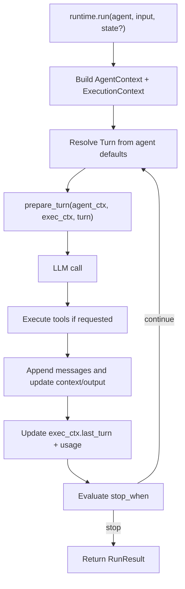

# V2 Agent Loop Design

## Design Goal

Design the v2 agent API so it feels like a small, elegant loop API rather than a large framework:

- One canonical persisted context: `AgentContext`
- One runtime context: `ExecutionContext`
- One per-turn control hook: `prepare_turn`
- One pluggable termination hook: `stop_when`
- One runtime boundary: the core agent loop stays slim; orchestration-heavy features live above it

This is a deliberate move away from the current shape in [src/factorial/agent/base.py](/Users/ricardo/Documents/code/nfactorial/src/factorial/agent/base.py), where `BaseAgent` currently exposes many constructor knobs including `context_window_limit`, `max_turns`, `context_class`, and multiple `on_*` callbacks, and from [src/factorial/execution/context.py](/Users/ricardo/Documents/code/nfactorial/src/factorial/execution/context.py), where `AgentContext` is currently a generic `BaseModel` with `extra = "allow"`.

This is a plan for a v2 API with BREAKING CHANGES. We DO NOT need to maintain backwards compatibility.

## User-Facing API

### Smallest useful agent

This should be the happy path for direct execution:

```python
from factorial import Agent, models

agent = Agent(
    model=models.gpt_5_mini,
    instructions="You are a concise assistant.",
)

result = await agent.run(
    "What changed in our API this week?"
)

print(result.output)
```

### Agent with tools

```python
from factorial import Agent, models, tool

@tool
async def web_search(query: str) -> str:
    ...

@tool
async def read_docs(path: str) -> str:
    ...

agent = Agent(
    model=models.gpt_5,
    instructions="Research thoroughly and cite concrete facts.",
    tools=[web_search, read_docs],
)

result = await agent.run(
    "Compare our current agent loop to the AI SDK loop model."
)
```

### Multimodal input

When you need images or files, pass an explicit message array as the `input` to `run(...)`.

```python
from factorial import Agent, file, image, models, user

agent = Agent(
    model=models.gpt_5,
    instructions="Compare visual and document inputs carefully.",
)

result = await agent.run([
    user(
        "Compare these screenshots and the attached spec.",
        image(path="before.png"),
        image(path="after.png"),
        file(path="requirements.pdf"),
    )
])
```

OpenAI-shaped typed dict content should also work directly:

```python
result = await agent.run([
    {
        "role": "user",
        "content": [
            {
                "type": "input_text",
                "text": "Compare these screenshots and the attached spec.",
            },
            {
                "type": "input_image",
                "image_url": "https://example.com/before.png",
                "detail": "high",
            },
            {
                "type": "input_image",
                "image_url": "https://example.com/after.png",
                "detail": "high",
            },
            {
                "type": "input_file",
                "file_url": "https://example.com/requirements.pdf",
                "filename": "requirements.pdf",
            },
        ],
    }
])
```

Design rule:

- `run(input=...)` accepts either a plain string or an explicit message array
- helper functions like `user(...)`, `image(...)`, and `file(...)` are the ergonomic path
- documented OpenAI-shaped typed dicts are accepted too, so users do not need to import many classes
- multimodal user content should stay close to the OpenAI Responses content-part shape
- helper-only convenience such as `path=` is acceptable as ergonomic sugar, but the normalized content should still map cleanly to `input_text`, `input_image`, and `input_file`

### Typed final output via explicit finish tool

If you want typed final output, model it explicitly as a normal tool and stop on that tool call.

```python
from pydantic import BaseModel
from factorial import Agent, models, tool, tool_called

class PlanResult(BaseModel):
    summary: str
    risks: list[str]

@tool
def done(result: PlanResult) -> PlanResult:
    return result

agent = Agent(
    model=models.gpt_5,
    instructions="Research the migration, then call done with the final plan.",
    tools=[web_search, read_docs, done],
    stop_when=tool_called("done"),
)

result = await agent.run("Plan the migration to v2.")
plan: PlanResult = result.output
```

Design rule:

- do not keep a built-in `output_type` agent knob in v2
- do not inject a hidden `final_output` pseudo-tool behind the scenes
- do not mutate prompts behind the scenes to force a hidden finish tool
- if you want typed final output, define a normal finish tool and stop on that tool explicitly

### Agent with typed state

This part of the design is already locked in:

```python
from dataclasses import dataclass
from factorial import Agent

@dataclass
class PlannerState:
    phase: str = "research"
    summary: str | None = None

agent = Agent[PlannerState](
    instructions="Plan technical changes in phases.",
)

result = await agent.run(
    "Plan the migration to the v2 agent loop."
)
```

Inside hooks, tools, verifiers, and callbacks:

```python
agent_ctx.state.phase
agent_ctx.state.summary
```

If the state type cannot be default-constructed, the caller provides `state=` at runtime:

```python
@dataclass
class PlannerState:
    repo_name: str
    phase: str = "research"

agent = Agent[PlannerState](
    instructions="Plan technical changes in phases.",
)

result = await agent.run(
    "Plan the migration to the v2 agent loop.",
    state=PlannerState(repo_name="nfactorial"),
)
```

### Execution entrypoints

Lock the execution ergonomics around two modes:

- Direct execution lives on the `Agent` itself.
- Queued / distributed execution lives on the `Orchestrator`.

Direct:

```python
result = await agent.run(
    "Plan the migration",
    state=PlannerState(repo_name="nfactorial"),
)
```

```python
async for event in agent.stream(
    "Research the AI SDK loop design",
    state=PlannerState(repo_name="nfactorial"),
):
    match event:
        case ToolStartEvent(tool_name=tool_name):
            print("calling", tool_name)
        case FinishEvent(output=output):
            print(output)
```

Queued:

```python
task = await orchestrator.enqueue(
    agent,
    input="Plan the migration",
    state=PlannerState(repo_name="nfactorial"),
    owner_id="user_123",
)
```

```python
batch = await orchestrator.enqueue_many(
    agent,
    inputs=[
        "Research OpenAI Agents SDK",
        "Research PydanticAI",
        "Research AI SDK",
    ],
    owner_id="user_123",
)
```

Design rule:

- `agent.run(...)` is the default and most ergonomic path
- `agent.stream(...)` is the default streaming path
- `orchestrator.enqueue(...)` is the explicit distributed path
- `orchestrator.enqueue_many(...)` accepts plain inputs for the common case
- single-run `input` accepts either a plain string or an explicit message array
- entrypoint-level `input` is normalized into canonical `AgentContext.messages` before persistence or execution
- avoid `agent.enqueue(...)`

### Orchestrator registration

The orchestrator setup API should also be simplified. Replace `register_runner(...)` with a slimmer `register(...)` surface that speaks in user intent rather than internal runner plumbing.

Common path:

```python
orchestrator = Orchestrator(...)

orchestrator.register(search_agent, workers=25, turn_timeout=120)
orchestrator.register(review_agent)
```

Advanced escape hatch:

```python
orchestrator.register(
    search_agent,
    worker_config=WorkerConfig(
        workers=25,
        turn_timeout=120,
    ),
    maintenance_config=MaintenanceConfig(...),
)
```

Design rule:

- the public API should talk about registering agents, not runners
- the common path should expose a few high-signal knobs directly, like `workers` and `turn_timeout`
- the advanced path may accept config objects, but those should be secondary
- the `Runner` type should not be a prominent public concept in the docs-first API
- decorator-based registration can exist later as optional sugar, but should not be the primary path

### Batch inputs with per-item context

When some batch items need distinct state or metadata, use `with_context(...)` rather than forcing a wrapper object into every entry:

```python
batch = await orchestrator.enqueue_many(
    agent,
    inputs=[
        "Research OpenAI Agents SDK",
        with_context(
            "Research PydanticAI",
            state=ResearchState(topic="pydantic"),
        ),
        with_context(
            "Research AI SDK",
            state=ResearchState(topic="vercel"),
            metadata=ResearchMetadata(source="vercel"),
        ),
    ],
    owner_id="user_123",
)
```

Design rule:

- keep the parameter name as `inputs`
- allow plain values like strings in the common case
- use `with_context(...)` for the exceptional case where one item needs its own initial `state` and/or `metadata`
- do not make users wrap every item in a named class just to use batching

Internally, the runtime can still normalize inputs to a structured representation if needed, but the public API should privilege the lightweight `with_context(...)` form.

### Run results and queued handles

Queued execution should return thin handles, not raw queue persistence records.

Single task:

```python
task = await orchestrator.enqueue(
    agent,
    input="Plan the migration",
    state=PlannerState(repo_name="nfactorial"),
    owner_id="user_123",
)

snapshot = await task.snapshot()

async for update in task.updates():
    ...

# Optional sugar over task.updates()
async for update in task:
    ...

result = await task.wait()
```

Batch:

```python
batch = await orchestrator.enqueue_many(
    agent,
    inputs=[
        "Research OpenAI Agents SDK",
        with_context(
            "Research PydanticAI",
            state=ResearchState(topic="pydantic"),
        ),
        with_context(
            "Research AI SDK",
            state=ResearchState(topic="vercel"),
            metadata=ResearchMetadata(source="vercel"),
        ),
    ],
    owner_id="user_123",
)

results = await batch.wait()
```

Design rule:

- `agent.run(...)` returns a terminal `RunResult`
- `await task.wait()` also returns that same terminal `RunResult`
- `task.updates()` is the explicit queued streaming surface
- `async for update in task` can exist as sugar over `task.updates()`
- queued updates should reuse the same typed event schema as `agent.stream(...)`
- `task.wait()` should first check a terminal snapshot, then wait on owner-scoped updates filtered to the task, ignore intermediate non-terminal states, and only fall back to periodic snapshot polling as a safety net
- `task.updates()` should yield typed event objects that work naturally with Python `match`
- low-level string `event_types` / `event_pattern` filtering should remain on `orchestrator.subscribe_to_updates(...)`, not on the nicer handle API
- `task.wait()` and `task.updates()` should be convenience wrappers over `orchestrator.subscribe_to_updates(...)`, not a second transport layer

## Core Types

### `AgentContext`

`AgentContext` stays canonical and persisted. It owns the canonical transcript, a small amount of persisted framework bookkeeping, and two typed user payloads:

- `.messages` for the canonical persisted transcript
- `.state` for mutable app logic
- `.metadata` for app-level identity / correlation / observability data

```python
from dataclasses import dataclass, field
from typing import Any, Generic, TypeVar

StateT = TypeVar("StateT")
MetadataT = TypeVar("MetadataT")

@dataclass
class EmptyState:
    pass

@dataclass(frozen=True)
class EmptyMetadata:
    pass

@dataclass
class AgentContext(Generic[StateT, MetadataT]):
    messages: list["Message"] = field(default_factory=list)
    turn_number: int = 1
    attempt_number: int = 1
    verification_attempts_used: int = 0
    output: Any | None = None
    state: StateT = field(default_factory=EmptyState)
    metadata: MetadataT = field(default_factory=EmptyMetadata)
```

This replaces the loose `extra = "allow"` model in [src/factorial/execution/context.py](/Users/ricardo/Documents/code/nfactorial/src/factorial/execution/context.py) with a fixed shell plus typed state and typed metadata.

Direct `run(input=...)` / `stream(input=...)` / `enqueue(input=...)` convenience should normalize immediately into `messages`; `input` should not be a second persisted source of truth.

Examples:

```python
@dataclass
class PlannerState:
    phase: str = "research"
    summary: str | None = None

@dataclass(frozen=True)
class RunMetadata:
    user_id: str
    session_id: str
    workspace_id: str
    request_id: str

agent = Agent[PlannerState, RunMetadata](
    instructions="Plan technical changes in phases.",
)
```

```python
result = await agent.run(
    "Plan the migration",
    state=PlannerState(repo_name="nfactorial"),
    metadata=RunMetadata(
        user_id="user_123",
        session_id="sess_abc",
        workspace_id="nfactorial",
        request_id="req_456",
    ),
)
```

Design rule:

- `messages` is the one canonical persisted transcript surface
- `state` is for mutable app logic and workflow state
- `metadata` is for app-level identity and correlation data
- `metadata` should be small, serializable, and read-only by convention
- framework-owned persisted bookkeeping such as `verification_attempts_used` can live on `AgentContext` when it must survive verification retries
- runtime-owned values like `task_id`, `owner_id`, `retry_count`, and transport/runtime capabilities remain on `ExecutionContext`

### `ExecutionContext`

`ExecutionContext` stays runtime-owned and ephemeral. It keeps capabilities plus lightweight aggregate execution metadata.

```python
@dataclass
class ExecutionContext:
    task_id: str
    owner_id: str
    events: EventPublisher | None = None
    retry_count: int = 0

    # Lightweight runtime metadata for the current run
    usage: "UsageSummary" = field(default_factory=UsageSummary.zero)
    last_turn: "TurnSummary | None" = None

    # Runtime-owned capabilities
    subagents: SubagentsNamespace = field(default_factory=SubagentsNamespace)
    messaging: MessagingNamespace = field(default_factory=MessagingNamespace)
    inbox: InboxNamespace = field(default_factory=InboxNamespace)
    signals: SignalsNamespace = field(default_factory=SignalsNamespace)
```

This keeps the spirit of the current `ExecutionContext` from [src/factorial/execution/context.py](/Users/ricardo/Documents/code/nfactorial/src/factorial/execution/context.py), while avoiding a heavy full turn-history ledger in the hot execution path.

### `Turn`

`Turn` is the mutable public object representing the next model call. The framework builds it from agent defaults plus current context, derives an ephemeral request transcript from `agent_ctx.messages`, and `prepare_turn` can mutate that next-call payload in place.

```python
@dataclass
class Turn:
    model: Model
    messages: list["Message"]
    tools: list[ToolDefinition]
    tool_choice: ToolChoice = "auto"
    parallel_tool_calls: bool | None = None
    temperature: float | None = None
    max_output_tokens: int | None = None
```

Design rule:

- `Agent(...)` contains static defaults
- `Agent.instructions` is authoring-time sugar only
- on the first run, `Agent.instructions` is translated into the initial leading `SystemMessage`
- `Turn` is the resolved, mutable per-turn request object
- `Turn.messages` is the full prompt surface for the next call, not the canonical persisted transcript
- the runtime should derive `Turn.messages` from `agent_ctx.messages` as an ephemeral request payload, typically by copying the normalized transcript rather than aliasing the same list
- `prepare_turn(...)` is the only public place that mutates the next turn
- `prepare_turn(...)` mutates the provided `Turn` in place and returns `None`
- `prepare_turn(...)` may reassign `turn.model`, `turn.messages`, `turn.tools`, `turn.tool_choice`, `turn.parallel_tool_calls`, `turn.temperature`, and `turn.max_output_tokens`
- `prepare_turn(...)` may append, remove, reorder, or fully replace `turn.messages`
- `prepare_turn(...)` may append, remove, reorder, or fully replace `turn.tools`
- do not require immutable `.replace(...)` patterns for turn shaping
- structured output is not a `Turn` concern in v2
- do not put `output_type` or provider-specific `response_format` on `Turn` in the first pass
- keep `parallel_tool_calls` on `Turn` as an advanced escape hatch rather than hiding it behind internal-only request objects
- do not introduce special compaction fields on `Turn`
- any immutable or provider-specific request object should remain internal-only

### `TurnSummary`

Each finished turn can produce a lightweight summary for `exec_ctx.last_turn`.

```python
@dataclass(frozen=True)
class TurnSummary:
    turn_number: int
    finish_reason: str
    status: str
    output: object | None
    usage: "UsageSummary" = field(default_factory=UsageSummary.zero)
```

This is intentionally tiny. Full detailed turn-by-turn history should belong on optional tracing/debug surfaces or an expanded `RunResult`, not on the live `ExecutionContext`.

### `RunResult`

`RunResult` should be the one terminal result type shared by direct and queued execution.

```python
class RunStatus(StrEnum):
    COMPLETED = "completed"
    FAILED = "failed"
    CANCELLED = "cancelled"

@dataclass(frozen=True)
class RunError:
    type: str
    message: str
    traceback: str | None = None

@dataclass(frozen=True)
class RunResult(Generic[OutputT, StateT, MetadataT]):
    run_id: str
    task_id: str | None
    agent_name: str
    owner_id: str | None
    status: RunStatus
    output: OutputT | None
    state: StateT
    metadata: MetadataT
    messages: tuple["Message", ...]
    usage: UsageSummary
    turn_count: int
    last_turn: TurnSummary | None = None
    verification: "VerificationSummary[Any] | None" = None
    started_at: datetime
    finished_at: datetime | None = None
    error: RunError | None = None
```

Design rule:

- direct and queued execution should converge on one result shape
- do not invent separate `TaskResult` / `QueuedRunResult` types
- `RunResult` is terminal state, not a live handle
- non-terminal waits, hook-pending states, and backoff should stay on task snapshots / update streams rather than appearing as `RunResult`
- if the run ends on normal assistant output, `RunResult.output` is that final output
- if the run ends because a finish tool triggered `stop_when`, `RunResult.output` is the result returned by that finish tool
- if the loop stops without finalized output, `RunResult.status` should be `FAILED` and `RunResult.output` should be `None`
- verification metadata lives on `RunResult.verification`, not inside `RunResult.output`
- verifier does not replace or transform the finalized output

### Verification

Verification should be a separate post-finalization decision layer, not part of `stop_when`.

```python
VerificationMetaT = TypeVar("VerificationMetaT")

VerifierDecision = (
    "VerifierAccept[VerificationMetaT]"
    | "VerifierRetry[VerificationMetaT]"
    | "VerifierFail[VerificationMetaT]"
)

@dataclass(frozen=True)
class VerifierAccept(Generic[VerificationMetaT]):
    metadata: VerificationMetaT | None = None

@dataclass(frozen=True)
class VerifierRetry(Generic[VerificationMetaT]):
    message: str
    code: str | None = None
    metadata: VerificationMetaT | None = None

@dataclass(frozen=True)
class VerifierFail(Generic[VerificationMetaT]):
    message: str
    code: str | None = None
    metadata: VerificationMetaT | None = None

@dataclass(frozen=True)
class VerificationSummary(Generic[VerificationMetaT]):
    status: Literal["accepted", "failed", "skipped"]
    attempts_used: int
    code: str | None = None
    message: str | None = None
    metadata: VerificationMetaT | None = None
```

```python
class verify:
    @staticmethod
    def accept(
        *,
        metadata: VerificationMetaT | None = None,
    ) -> VerifierAccept[VerificationMetaT]: ...

    @staticmethod
    def retry(
        message: str,
        *,
        code: str | None = None,
        metadata: VerificationMetaT | None = None,
    ) -> VerifierRetry[VerificationMetaT]: ...

    @staticmethod
    def fail(
        message: str,
        *,
        code: str | None = None,
        metadata: VerificationMetaT | None = None,
    ) -> VerifierFail[VerificationMetaT]: ...
```

Design rule:

- verifier handles acceptance policy after a candidate final output is produced
- `stop_when` governs loop termination, not verification retries/failures
- verifier receives the finalized output as its first argument
- verifier may optionally request kw-only injected `agent_ctx` and `execution_ctx`
- `agent_ctx.verification_attempts_used` is the persisted count of prior `verify.retry(...)` decisions already consumed before the current verifier call
- do not keep a separate public `VerificationContext` type if the only extra input is that counter
- verifier returns a `VerifierDecision`, it does not throw for expected retry/fail outcomes
- verifier exceptions still represent real verifier/system errors
- verifier may attach typed metadata
- verifier metadata should be stored on `RunResult.verification`
- finalized output stays on `RunResult.output`

Example: typed verification metadata

```python
@dataclass(frozen=True)
class PlanVerification:
    score: float
    missing_sections: list[str]

def verify_plan(
    output: PlanResult,
    *,
    agent_ctx: AgentContext[PlannerState, RunMetadata],
) -> VerifierDecision[PlanVerification]:
    score = score_plan(output)
    meta = PlanVerification(
        score=score,
        missing_sections=find_missing_sections(output),
    )

    if score >= 0.8:
        return verify.accept(metadata=meta)

    if agent_ctx.verification_attempts_used >= 2:
        return verify.fail(
            "Plan failed verification 3 times.",
            code="score_low",
            metadata=meta,
        )

    return verify.retry(
        "Plan needs stronger evidence.",
        code="score_low",
        metadata=meta,
    )
```

Verification runtime semantics:

- if verifier returns `verify.accept(...)`, the run finalizes successfully
- if verifier returns `verify.retry(...)`, verifier feedback is appended, `agent_ctx.verification_attempts_used` is incremented, and the loop continues
- if verifier returns `verify.fail(...)`, the run fails immediately
- if verifier raises an unexpected exception, treat it as a verifier/system error rather than a normal verification outcome

### `TaskHandle`

*Queued single-run execution should return a thin handle instead of a raw* `Task` *persistence object.*

```python
class TaskHandle(Generic[OutputT, StateT, MetadataT]):
    id: str
    agent_name: str
    owner_id: str
    batch_id: str | None

    async def snapshot(self) -> "TaskSnapshot[StateT, MetadataT]": ...
    async def hooks(self) -> tuple["PendingHookHandle[Any]", ...]: ...
    async def hook(self, hook_id: str) -> "PendingHookHandle[Any]": ...
    async def wait(
        self,
        *,
        timeout: float | None = None,
    ) -> RunResult[OutputT, StateT, MetadataT]: ...
    async def updates(
        self,
        *,
        types: tuple[type["AgentEvent"], ...] | None = None,
    ) -> AsyncIterator["AgentEvent"]: ...
    def __aiter__(self) -> AsyncIterator["AgentEvent"]: ...
    async def cancel(self) -> None: ...
    async def steer(self, input: str | list["Message"]) -> None: ...
    async def wake(self, input: str | list["MessageLike"] | None = None) -> bool: ...
    async def branch(
        self,
        input: str | list["Message"],
        *,
        state: StateT | None = None,
        metadata: MetadataT | None = None,
    ) -> "TaskHandle[OutputT, StateT, MetadataT]": ...
```

```python
class TaskSnapshotStatus(StrEnum):
    QUEUED = "queued"
    RUNNING = "running"
    WAITING = "waiting"
    BACKOFF = "backoff"
    COMPLETED = "completed"
    FAILED = "failed"
    CANCELLED = "cancelled"

class WaitKind(StrEnum):
    SLEEP = "sleep"
    CRON = "cron"
    SIGNAL = "signal"
    ACTIVITY = "activity"

class HookMode(StrEnum):
    REQUIRES = "requires"
    AWAITS = "awaits"

class HookCompletionStatus(StrEnum):
    RESOLVED = "resolved"
    IDEMPOTENT = "idempotent"

@dataclass(frozen=True)
class WaitSnapshot:
    kind: WaitKind
    wake_at: datetime | None = None
    signal_id: str | None = None
    source_tool_call_ids: tuple[str, ...] = ()
    data: Any = None

@dataclass(frozen=True)
class PendingHookSnapshot:
    id: str
    hook_type: str
    mode: HookMode
    title: str | None
    tool_name: str | None
    param_name: str | None
    expires_at: datetime
    metadata: Mapping[str, Any]

@dataclass(frozen=True)
class HookCompletionResult:
    status: HookCompletionStatus
    task_resumed: bool

class PendingHookHandle(Generic[HookPayloadT]):
    @property
    def snapshot(self) -> PendingHookSnapshot: ...

    async def complete(
        self,
        payload: HookPayloadT | Mapping[str, Any],
    ) -> HookCompletionResult: ...

```

```python
@dataclass(frozen=True)
class TaskSnapshot(Generic[StateT, MetadataT]):
    id: str
    agent_name: str
    owner_id: str
    batch_id: str | None
    status: TaskSnapshotStatus
    state: StateT
    metadata: MetadataT
    output: object | None
    retry_count: int
    turn_number: int
    last_turn: TurnSummary | None = None
    wait: WaitSnapshot | None = None
    pending_hooks: tuple[PendingHookSnapshot, ...] = ()
    pending_child_task_ids: tuple[str, ...] = ()
    backoff_until: datetime | None = None
```

*Design rule:*

- `snapshot()` *is the pull API*
- `updates()` *is the push API*
- `__aiter__` *can delegate directly to* `updates()`
- `wait()` *should prefer event-driven wakeups and use polling only as a fallback*
- `updates()` *should yield typed events, not dicts or stringly payload envelopes*
- public branching surfaces like `RunStatus`, `TaskSnapshotStatus`, `WaitKind`, and `HookMode` should prefer `StrEnum`
- raw wire-shaped message dicts should keep `Literal[...]` fields so they stay close to provider payloads
- `steer()` *belongs on the handle because it acts on an existing queued run*
- `snapshot.status` *should be a smaller normalized public surface, not a dump of raw internal queue states*
- non-terminal detail should live in adjacent fields like `wait`, `pending_hooks`, and `pending_child_task_ids`
- internal `processing` / `active` should map to public `running`
- internal `paused`, `pending_tool_results`, and `pending_child_tasks` should map to public `waiting`
- internal `backoff` can remain public `backoff`
- `branch()` *creates a new child task from a terminal task and should reject all non-terminal tasks*
- `wake()` *is primarily for waking* `signal` *waits, but may also short-circuit* `sleep`, `cron`, *and* `activity` *waits as an explicit operator override*
- `wake()` *should reject hooks, child-task waits, backoff, queued/running tasks, and terminal tasks*
- `wake()` *should return* `True` *when this call actually woke the task*
- `wake()` *should return* `False` *only when the task was on a wakeable wait but another actor or runtime path won the race first*
- `task.wake(...)` *should accept message-style input rather than an opaque payload*
- any manual wake should inject a short runtime/system message explaining that the task was manually resumed and what wait kind was interrupted
- if `task.wake(input=...)` is provided, that input should be normalized and appended after the runtime/system manual-wake note
- for `signal` waits, `task.wake(input)` uses the already-pending `signal_id`; callers do not pass the `signal_id` again
- for `sleep` and `cron`, `task.wake()` is a one-off operator override of the current parked turn, not a persistent schedule change
- for `activity`, `task.wake()` resumes the task and should still inject the manual-wake note/input rather than fabricating a fake activity event
- if users need a lower-level structured signal payload API, that should stay on signaling/control-plane surfaces rather than overloading `task.wake(...)`
- the hook authoring model should stay the same: `Hook`, `Hook.pending(...)`, `hook.requires(...)`, and `hook.awaits(...)`
- hook discovery should happen through `snapshot.pending_hooks`, `task.hooks()`, and `task.hook(id)`
- typed hook responses should stay in the hook system via `PendingHookHandle.complete(...)`, not become generic task-handle methods
- `PendingHookHandle.complete(...)` should not require an idempotency key for normal in-process use
- low-level `orchestrator.resolve_hook(...)` may still accept an optional `idempotency_key` for HTTP/webhook retry safety
- no generic `resume()` or `reply()` in the first pass
- do not introduce a new public `paused` task concept in v2
- `task.wait()` should continue waiting through non-terminal states and only return on terminal completion, failure, or cancellation

Example: check current status

```python
task = await orchestrator.enqueue(
    planner_agent,
    input="Plan the migration to the new API",
    state=PlannerState(repo_name="nfactorial"),
    owner_id="user_123",
)

snapshot = await task.snapshot()

if snapshot.status in {
    TaskSnapshotStatus.QUEUED,
    TaskSnapshotStatus.RUNNING,
    TaskSnapshotStatus.WAITING,
    TaskSnapshotStatus.BACKOFF,
}:
    print("still in progress")
    if snapshot.pending_hooks:
        print("awaiting hook", snapshot.pending_hooks[0].id)
    elif snapshot.wait is not None:
        print("waiting on", snapshot.wait.kind)
elif snapshot.status is TaskSnapshotStatus.COMPLETED:
    print(snapshot.output)
```

Example: wait for the final result

```python
result = await task.wait(timeout=300)

if result.status == RunStatus.COMPLETED:
    print(result.output)
else:
    print(result.error)
```

Example: stream live task updates

```python
async for event in task.updates(types=(TurnStartEvent, TurnFinishEvent, WaitEvent, FinishEvent)):
    match event:
        case TurnStartEvent(turn_number=turn):
            print("starting turn", turn)
        case TurnFinishEvent(turn_number=turn):
            print("finished turn", turn)
        case WaitEvent():
            print("waiting")
        case FinishEvent(status=RunStatus.COMPLETED, output=output):
            print("done", output)
```

Equivalent sugar:

```python
async for event in task:
    match event:
        case FinishEvent():
            print("done")
        case _:
            pass
```

Example: steer a running task

```python
await task.steer(
    "Focus on the developer ergonomics tradeoffs, not implementation details."
)
```

Example: wake a scheduled wait

```python
try:
    woke = await task.wake(
        "Manual wake: the dependency finished early. Continue from here."
    )
    print("woke" if woke else "someone else already woke it")
except RuntimeError:
    print("task is not on a manually wakeable wait")
```

Example: wake a signal wait with input

```python
snapshot = await task.snapshot()

if snapshot.wait and snapshot.wait.kind is WaitKind.SIGNAL:
    await task.wake("Approval granted. Continue with execution.")
```

Example: complete a pending hook from a handle

```python
snapshot = await task.snapshot()

if snapshot.pending_hooks:
    approval = await task.hook(snapshot.pending_hooks[0].id)
    await approval.complete({"approved": True})
```

Low-level external integration path:

```python
await orchestrator.resolve_hook(
    hook_id=hook_id,
    payload={"approved": True},
    token=token,
    idempotency_key="evt-approval-1",  # optional retry safety for HTTP/webhooks
)
```

Design rule:

- `orchestrator.resolve_hook(...)` remains the low-level external/API-facing completion path
- handle-based hook completion is the ergonomic in-process control path
- a hook still has one logical resolution; idempotency keys are transport safety, not core hook semantics
- snapshots and handles should never require the caller to manually juggle raw hook tokens
- keep waits and hooks as separate concepts: `task.wake()` is for explicit waits, `hook.complete(...)` is for typed hook payloads

Example: branch from a terminal task

```python
revision_task = await task.branch(
    "Revise the plan with a stronger migration section."
)

revision_result = await revision_task.wait()
```

Example: cancel a task

```python
await task.cancel()
```

### `BatchHandle`

*Queued batch execution should return a thin batch handle that aggregates task handles rather than a separate heavy batch result object.*

```python
class BatchHandle(Generic[OutputT, StateT, MetadataT]):
    id: str
    agent_name: str
    owner_id: str
    task_ids: tuple[str, ...]

    @property
    def tasks(self) -> tuple[TaskHandle[OutputT, StateT, MetadataT], ...]:
        ...

    async def snapshot(self) -> "BatchSnapshot": ...
    async def wait(
        self,
        *,
        timeout: float | None = None,
    ) -> tuple[RunResult[OutputT, StateT, MetadataT], ...]: ...
    async def updates(
        self,
        *,
        types: tuple[type["AgentEvent"], ...] | None = None,
    ) -> AsyncIterator["AgentEvent"]: ...
    async def cancel(self) -> None: ...
```

```python
@dataclass(frozen=True)
class BatchSnapshot:
    id: str
    owner_id: str
    total_tasks: int
    remaining_tasks: int
    progress: float
    is_finished: bool
```

Design rule:

- no dedicated `BatchResult` in the first pass
- `BatchHandle.wait()` can simply return `tuple[RunResult, ...]`
- batch streaming should be a convenience wrapper over owner-scoped updates filtered to the batch's tasks or batch id
- batch updates should yield the same typed per-task events as `task.updates()`, with `task_id` available on the event

Example: inspect batch progress

```python
batch = await orchestrator.enqueue_many(
    research_agent,
    inputs=[
        "Research OpenAI Agents SDK",
        "Research PydanticAI",
        "Research AI SDK",
    ],
    owner_id="user_123",
)

snapshot = await batch.snapshot()
print(snapshot.progress)
print(snapshot.remaining_tasks)
```

Example: wait for every task to finish

```python
results = await batch.wait(timeout=600)

for result in results:
    print(result.status, result.output)
```

Example: stream batch-level updates

```python
async for event in batch.updates(types=(FinishEvent,)):
    match event:
        case FinishEvent(task_id=task_id, status=RunStatus.COMPLETED, output=output):
            print("completed", task_id, output)
        case FinishEvent(task_id=task_id, status=RunStatus.FAILED, error=error):
            print("failed", task_id, error)
```

Example: access individual task handles from the batch

```python
first_task = batch.tasks[0]
first_result = await first_task.wait()
print(first_result.output)
```

Example: cancel the whole batch

```python
await batch.cancel()
```

## `prepare_turn`

### Signature

```python
PrepareTurn = Callable[
    [AgentContext[StateT, MetadataT], ExecutionContext, Turn],
    None | Awaitable[None],
]
```

### Semantics

`prepare_turn` runs immediately before the model call.

It is the single public control point for:

- switching models
- enabling or disabling parallel tool calls
- changing temperature
- changing max output tokens
- trimming or compacting messages
- restricting tools
- forcing a tool choice
- adding or replacing explicit guidance messages

It replaces the need for public `prepare_messages`, public reducers, prompt filters, tool selectors, and most runtime callback mutation patterns.

Mutation contract:

- `prepare_turn(...)` receives the already-resolved `Turn` for the next model call
- the framework ignores return values; mutation happens by editing the passed-in `turn`
- callers may mutate list contents in place or assign a brand new list to `turn.messages` / `turn.tools`
- callers may set scalar fields directly, for example `turn.temperature = 0.2` or `turn.parallel_tool_calls = False`
- the framework should treat the final post-mutation `Turn` object as authoritative for that turn
- `turn.messages` is an ephemeral next-call payload derived from `agent_ctx.messages`; mutating it shapes this request only and should not rewrite the canonical transcript
- provider-specific escape hatches belong in internal runtime code, not on the public `Turn`

### Optional composition helper

For non-trivial agents, it should be easy to split turn shaping into a few small helpers instead of growing one monolithic `prepare_turn(...)`.

A tiny `chain_prepare_turn(...)` helper can exist as optional sugar, but it should stay a lightweight utility rather than a middleware stack:

```python
import inspect

def chain_prepare_turn(*steps):
    async def prepare_turn(agent_ctx, exec_ctx, turn):
        for step in steps:
            result = step(agent_ctx, exec_ctx, turn)
            if inspect.isawaitable(result):
                await result
    return prepare_turn
```

### Example: compaction and model routing

```python
from factorial import Agent, SystemMessage, compact_messages, models

async def prepare_turn(agent_ctx, exec_ctx, turn):
    # Compact long transcripts in one place.
    if len(turn.messages) > 20:
        summary, recent_messages = compact_messages(
            turn.messages,
            keep_system=True,
            keep_recent=12,
            summarize_old=True,
        )
        turn.messages = [
            *recent_messages,
            SystemMessage(content=f"Earlier context summary:\n{summary}"),
        ]

    # Use a cheaper model during the research phase.
    if agent_ctx.state.phase == "research":
        turn.model = models.gpt_5_mini
        turn.temperature = 0.2
        turn.max_output_tokens = 1200

    # Force only research tools during the research phase.
    if agent_ctx.state.phase == "research":
        turn.tools = [web_search, read_docs]
        turn.tool_choice = "required"

agent = Agent[PlannerState, RunMetadata](
    model=models.gpt_5,
    instructions="Plan technical changes in phases.",
    tools=[web_search, read_docs, write_plan, done],
    prepare_turn=prepare_turn,
)
```

### Example: dynamic guidance message

```python
def prepare_turn(agent_ctx, exec_ctx, turn):
    if agent_ctx.state.summary:
        turn.messages.append(
            SystemMessage(
                content=f"Running summary:\n{agent_ctx.state.summary}"
            )
        )
```

## `stop_when`

### Signature

```python
StopCondition = Callable[
    [AgentContext[StateT, MetadataT], ExecutionContext],
    bool,
]

StopWhen = StopCondition | Sequence[StopCondition]
```

### Semantics

`stop_when` is evaluated after each completed turn.

It should own pluggable loop termination. Typed completion should be modeled explicitly with ordinary tools such as `done(...)`, not with hidden framework-injected finish tools.

`stop_when` accepts:

- a single condition
- a top-level array of conditions, which is normalized to `any_of(...)`

Nested composition should stay explicit with `any_of(...)` and `all_of(...)`.

If `stop_when` is omitted, the framework should use this implicit default:

```python
any_of(
    no_tool_calls(),
    turn_count_is(10),
)
```

That means the default behavior is:

- if a turn ends with no tool calls, the run completes with that assistant output
- otherwise the loop continues
- if the run has not naturally finalized by turn 10, it stops and fails

If `stop_when` is provided, it fully governs loop termination:

- there is no implicit `no_tool_calls()` auto-finish
- there is no implicit default turn cutoff
- if you want no-tool assistant answers to end the run, include `no_tool_calls()` explicitly
- if you pass a top-level array, it means `any_of(...)`

When `stop_when` causes the loop to stop:

- if the current turn produced finalized output, the run completes successfully
- if the current turn did not produce finalized output, the run fails with no output

### Built-ins

```python
no_tool_calls()
turn_count_is(12)
tool_called("done")
total_tokens_exceed(80_000)
any_of(...)
all_of(...)
```

### Example: built-in conditions

```python
agent = Agent(
    model=models.gpt_5,
    instructions="Research, analyze, then finish.",
    tools=[web_search, analyze, done],
    stop_when=any_of(
        no_tool_calls(),
        turn_count_is(12),
        tool_called("done"),
        total_tokens_exceed(80_000),
    ),
)
```

Equivalent shorthand:

```python
agent = Agent(
    model=models.gpt_5,
    instructions="Research, analyze, then finish.",
    tools=[web_search, analyze, done],
    stop_when=[
        no_tool_calls(),
        turn_count_is(12),
        tool_called("done"),
        total_tokens_exceed(80_000),
    ],
)
```

### Example: implicit default when omitted

```python
agent = Agent(
    model=models.gpt_5,
    instructions="Research, analyze, then finish.",
    tools=[web_search, analyze],
)

# Equivalent default:
# stop_when=any_of(no_tool_calls(), turn_count_is(10))
```

### Example: typed completion with an explicit finish tool

```python
class PlanResult(BaseModel):
    summary: str
    risks: list[str]

@tool
def done(result: PlanResult) -> PlanResult:
    return result

agent = Agent(
    model=models.gpt_5,
    instructions="Research, analyze, then call done with the final plan.",
    tools=[web_search, analyze, done],
    stop_when=tool_called("done"),
)
```

### Example: grouped composition

```python
agent = Agent(
    model=models.gpt_5,
    instructions="Research, then finish cleanly or fail fast on limits.",
    tools=[web_search, analyze, done],
    stop_when=[
        any_of(
            no_tool_calls(),
            tool_called("done"),
        ),
        all_of(
            turn_count_is(12),
            total_tokens_exceed(80_000),
        ),
    ],
)
```

### Example: custom condition

```python
def stop_when(agent_ctx, exec_ctx):
    too_expensive = exec_ctx.usage.total_tokens > 80_000
    done_called = (
        exec_ctx.last_turn is not None
        and exec_ctx.last_turn.finish_reason == "tool_called:done"
    )
    no_tools = (
        exec_ctx.last_turn is not None
        and exec_ctx.last_turn.finish_reason == "stop"
    )
    return too_expensive or done_called or no_tools
```

### Migration rule

Current `max_turns` from [src/factorial/agent/base.py](/Users/ricardo/Documents/code/nfactorial/src/factorial/agent/base.py) becomes:

```python
stop_when=turn_count_is(n)
```

`max_turns` may remain as temporary sugar, but the canonical API becomes `stop_when`.

If you want the old simple "finish when the model answers normally" behavior, include:

```python
stop_when=any_of(
    no_tool_calls(),
    turn_count_is(n),
)
```

## Lifecycle Callbacks

Keep callbacks, but make them observational only.

Recommended set:

```python
Agent(
    ...,
    callbacks=Callbacks(
        on_start=...,
        on_turn_start=...,
        on_model_start=...,
        on_model_finish=...,
        on_tool_start=...,
        on_tool_finish=...,
        on_turn_finish=...,
        on_wait=...,
        on_finish=...,
    ),
)
```

Design rule:

- callbacks can log, trace, publish events, or update metrics
- callbacks should not be the main API for mutating loop behavior
- `prepare_turn` and `stop_when` own loop control
- callbacks are defined at the agent level only
- `agent.run(...)` and `agent.stream(...)` should not accept extra per-run callbacks
- `orchestrator.enqueue(...)` and `enqueue_many(...)` should not accept arbitrary Python callbacks
- queued/distributed observability should go through event streams, subscriptions, tracing, or webhooks instead of ad-hoc callback injection

### Callback signature convention

Callbacks should receive one typed event object as the primary parameter.

Base callback type:

```python
EventCallback = Callable[[EventT], None | Awaitable[None]]
```

The same typed event objects should power:

- agent-level callbacks
- `agent.stream(...)`
- `task.updates()`
- `batch.updates()`

```python
AgentEvent = (
    StartEvent
    | TurnStartEvent
    | ModelStartEvent
    | ModelFinishEvent
    | ToolStartEvent
    | ToolFinishEvent
    | TurnFinishEvent
    | WaitEvent
    | FinishEvent
)
```

Design rule:

- high-level streaming APIs should yield typed event objects, not raw dicts
- `match event:` should be the preferred consumption pattern
- raw string `event_type` / regex filtering should stay on low-level transport-facing APIs like `orchestrator.subscribe_to_updates(...)`

Examples:

```python
def on_finish(event: FinishEvent[PlannerState, RunMetadata]) -> None:
    ...
```

Callbacks may optionally request injected context, but only in a narrow, explicit form:

- the event must be the first positional parameter
- optional injected values must be keyword-only
- supported injected values are limited to `agent_ctx` and `execution_ctx`
- no general-purpose DI container
- no arbitrary positional reordering

Supported:

```python
def on_finish(
    event: FinishEvent[PlannerState, RunMetadata],
    *,
    agent_ctx: AgentContext[PlannerState, RunMetadata],
    execution_ctx: ExecutionContext,
) -> None:
    logger.info(
        "finished",
        extra={
            "user_id": agent_ctx.metadata.user_id,
            "workspace_id": agent_ctx.metadata.workspace_id,
            "owner_id": execution_ctx.owner_id,
            "retry_count": execution_ctx.retry_count,
        },
    )
```

Also supported, because kw-only injected params can appear in any order:

```python
def on_finish(
    event: FinishEvent[PlannerState, RunMetadata],
    *,
    execution_ctx: ExecutionContext,
    agent_ctx: AgentContext[PlannerState, RunMetadata],
) -> None:
    ...
```

Not supported:

```python
def on_finish(
    agent_ctx: AgentContext[PlannerState, RunMetadata],
    execution_ctx: ExecutionContext,
    event: FinishEvent[PlannerState, RunMetadata],
) -> None:
    ...
```

This keeps callbacks ergonomic for tracing and logging without turning them into a second general-purpose hook/mutation system.

This is a deliberate simplification of the current many `on_*` constructor callbacks in [src/factorial/agent/base.py](/Users/ricardo/Documents/code/nfactorial/src/factorial/agent/base.py).

## Message Model

Keep the canonical transcript model small and typed. Distinguish the public authoring helpers from the normalized transcript shape.

```python
Message = (
    SystemMessage
    | UserMessage
    | AssistantMessage
    | ToolCallMessage
    | ToolResultMessage
)
```

```python
class InputTextDict(TypedDict):
    type: Literal["input_text"]
    text: str

class InputImageDict(TypedDict, total=False):
    type: Literal["input_image"]
    image_url: str
    file_id: str
    detail: Literal["auto", "low", "high"]

class InputFileDict(TypedDict, total=False):
    type: Literal["input_file"]
    file_id: str
    file_url: str
    file_data: str
    filename: str

class SystemMessageDict(TypedDict):
    role: Literal["system"]
    content: str

class UserMessageDict(TypedDict):
    role: Literal["user"]
    content: str | list[InputTextDict | InputImageDict | InputFileDict]

class AssistantMessageDict(TypedDict):
    role: Literal["assistant"]
    content: str

class ToolCallDict(TypedDict):
    id: str
    name: str
    arguments: object

class ToolCallMessageDict(TypedDict):
    role: Literal["assistant_tool_calls"]
    calls: list[ToolCallDict]

class ToolResultMessageDict(TypedDict, total=False):
    role: Literal["tool"]
    tool_call_id: str
    tool_name: str | None
    output: object
    is_error: bool

@dataclass(frozen=True)
class ImageInput:
    path: str | PathLike[str] | None = None
    image_url: str | None = None
    file_id: str | None = None
    detail: Literal["auto", "low", "high"] = "auto"

@dataclass(frozen=True)
class FileInput:
    path: str | PathLike[str] | None = None
    file_id: str | None = None
    file_url: str | None = None
    file_data: bytes | str | None = None
    filename: str | None = None

ContentPartLike = (
    str
    | InputTextDict
    | InputImageDict
    | InputFileDict
    | ImageInput
    | FileInput
)

MessageLike = (
    SystemMessageDict
    | UserMessageDict
    | AssistantMessageDict
    | ToolCallMessageDict
    | ToolResultMessageDict
)
```

```python
def system(content: str) -> SystemMessageDict: ...
def user(*parts: ContentPartLike) -> UserMessageDict: ...
def assistant(content: str) -> AssistantMessageDict: ...

def tool_call(
    name: str,
    arguments: object,
    *,
    call_id: str | None = None,
) -> ToolCallDict: ...

def tool_calls(*calls: ToolCallDict) -> ToolCallMessageDict: ...

def tool_result(
    tool_call_id: str,
    output: object,
    *,
    tool_name: str | None = None,
    is_error: bool = False,
) -> ToolResultMessageDict: ...

def image(
    *,
    image_url: str | None = None,
    file_id: str | None = None,
    path: str | None = None,
    detail: Literal["auto", "low", "high"] = "auto",
) -> ImageInput: ...

def file(
    *,
    file_id: str | None = None,
    file_url: str | None = None,
    file_data: str | None = None,
    path: str | None = None,
    filename: str | None = None,
) -> FileInput: ...
```

Design rule:

- no arbitrary untyped `dict[str, Any]` transcript API
- no giant multimodal message algebra in v2
- `assistant(...)` is natural-language assistant content only; tool calls and tool results are separate first-class message kinds
- function-based builders are the happy path for declaring messages
- raw typed dicts are accepted as an ergonomic escape hatch, including explicit tool-call and tool-result message shapes
- multimodal content should stay close to OpenAI Responses naming like `input_text`, `input_image`, and `input_file`
- `path=` is helper-only sugar on `image(...)` and `file(...)`, not part of the persisted transcript contract
- `path=` should be resolved at the `run(...)` / `stream(...)` / `enqueue(...)` normalization boundary, before persistence or model execution
- queued execution should not depend on a worker later reopening the original filesystem path
- if a provider returns assistant text and tool calls in the same model turn, normalize that into adjacent `AssistantMessage` then `ToolCallMessage` entries in the canonical transcript
- compaction is explicit in `prepare_turn(...)` by mutating `turn.messages` for the next model call, not by rewriting `agent_ctx.messages` by default
- no special summary message type and no special summary slot on `Turn`

## Runtime Boundary

### `Agent`: authored loop API

`Agent` is the docs-first authoring surface. It should contain the portable loop definition that works the same for direct and orchestrated execution:

- model defaults
- instructions
- tools
- hook declarations attached to tools via `Hook`, `hook.requires(...)`, and `hook.awaits(...)`
- `prepare_turn`
- `stop_when`
- verifier
- observational callbacks
- direct execution entrypoints: `run(...)` and `stream(...)`

`Agent` should **not** own queueing, worker registration, owner-scoped subscriptions, hook resolution APIs, task lookup, or distributed retry/backoff config.

This is the layer that should replace the current public weight of [src/factorial/agent/base.py](/Users/ricardo/Documents/code/nfactorial/src/factorial/agent/base.py).

### `ExecutionContext`: runtime capability surface inside an active run

`ExecutionContext` is the ephemeral capability surface available only while a run is actively executing. It should contain:

- run/task identity and correlation fields needed at execution time
- logical retry/attempt metadata such as `retry_count`
- aggregate usage
- `last_turn`
- wake metadata for the current wake-up
- namespaced runtime capabilities used from tools/hooks:
  - `subagents`
  - `messaging`
  - `inbox`

Design rule:

- `ExecutionContext` is for *using* runtime capabilities during execution, not for configuring the runtime
- `ExecutionContext` should not expose control-plane task lookup, worker config, registration, or subscription APIs
- `wait.`* helpers are runtime vocabulary used by executing tools, but waking those waits belongs to task handles / orchestrator control surfaces
- hook declaration belongs with tools, but hook persistence and completion belong to runtime/control-plane layers
- internal callback wiring such as low-level hook-session persistence can exist behind `ExecutionContext`, but should not become a prominent docs-first API

### `Orchestrator`: control plane and distributed runtime

`Orchestrator` owns the queued/distributed execution model and the control plane around it. It should contain:

- `register(...)` plus advanced worker/maintenance config
- `enqueue(...)` and `enqueue_many(...)`
- task and batch handles
- handle lookup / control-plane operations for existing tasks
- owner-scoped update subscriptions
- low-level external hook resolution APIs
- worker retry/backoff policy
- task ownership, wake dispatch, and registration lifecycle
- platform/runtime mode configuration

Design rule:

- the common path should be `orchestrator.register(agent, workers=..., turn_timeout=...)`
- advanced knobs like maintenance intervals, wake transport, and process/platform configuration stay on orchestrator config objects
- `orchestrator.subscribe_to_updates(...)` remains the low-level transport-facing subscription API
- `task.updates()` / `task.wait()` / `batch.updates()` are higher-level convenience wrappers over orchestrator subscriptions
- external/API-facing hook completion lives here as `orchestrator.resolve_hook(...)`
- `Orchestrator` should talk about agents and tasks, not runners

### Internal-only runtime and persistence

These concepts may still exist in the implementation, but should not be docs-first public abstractions:

- `Runner`
- any direct/local runtime implementation object behind `agent.run(...)`
- queue persistence records and raw task/batch storage models
- raw queue status enums and retry bookkeeping
- Redis/Lua scripts, wake dispatch internals, and maintenance loops
- hook session persistence internals
- provider-specific request objects and transport details

Design rule:

- users should think in terms of `Agent`, `ExecutionContext`, `Orchestrator`, `TaskHandle`, and `BatchHandle`
- they should not need to understand runner plumbing or queue storage records to use the framework well
- direct and queued execution should share one authored `Agent`; only the entrypoint and control plane differ

### Example: same agent, different execution modes

```python
agent = Agent[PlannerState](
    model=models.gpt_5,
    instructions="Plan technical changes in phases.",
    tools=[web_search, read_docs, write_plan, done],
    prepare_turn=prepare_turn,
    stop_when=tool_called("done"),
)

# Direct execution
result = await agent.run(
    "Plan the migration",
    state=PlannerState(repo_name="nfactorial"),
)
```

```python
# Orchestrated execution
task = await orchestrator.enqueue(
    agent,
    input="Plan the migration",
    state=PlannerState(repo_name="nfactorial"),
    owner_id="user_123",
)
```

The authored `Agent` stays the same. The execution entrypoint changes, not the loop API.

## End-To-End Loop




## Mapping From Current API

### What stays

- `ExecutionContext` remains the runtime-owned capability surface from [src/factorial/execution/context.py](/Users/ricardo/Documents/code/nfactorial/src/factorial/execution/context.py)
- the orchestrator remains the runtime/orchestration layer from [src/factorial/orchestrator/core.py](/Users/ricardo/Documents/code/nfactorial/src/factorial/orchestrator/core.py)
- verification can remain, but should validate explicit final output rather than depending on hidden `output_type` machinery
- runtime capabilities like subagents, messaging, inbox access, and wake metadata remain execution-time concepts, not agent constructor knobs
- low-level external hook resolution can remain on the orchestrator

### What changes

- `AgentContext` stops being a loose model with arbitrary extra fields
- `context_class` stops being the normal customization path
- `prepare_messages()` becomes internal
- `context_window_limit` is removed as a top-level public loop concept
- `max_turns` becomes sugar for `turn_count_is(n)` or is deprecated
- `output_type` is removed from the core agent API
- hidden `final_output` tool injection is removed
- raw message dicts are replaced by typed message objects
- `register_runner(...)` is replaced by `orchestrator.register(...)`
- the public setup story stops exposing `Runner` as a docs-first concept
- queued execution returns `TaskHandle` / `BatchHandle` instead of raw queue records
- direct execution no longer teaches a public `LocalRuntime()` object; `agent.run(...)` is the direct path
- queue retry/backoff policy moves firmly into orchestrator/runtime config rather than the core loop API
- waits and hooks are split cleanly:
  - declaring waits/hooks belongs to tool/runtime authoring
  - waking waits belongs to handles/control-plane APIs
  - resolving hooks belongs to hook handles or orchestrator control-plane APIs

### What should become internal-only

- runner lifecycle details
- queue storage details
- wake dispatch plumbing
- raw pubsub filtering details
- hidden prompt/tool injection machinery
- low-level execution-context callback plumbing that only exists to bridge runtime internals

### What the new constructor should feel like

```python
agent = Agent[PlannerState](
    model=models.gpt_5,
    instructions="Plan technical changes in phases.",
    tools=[web_search, read_docs, write_plan, done],
    prepare_turn=prepare_turn,
    stop_when=any_of(
        tool_called("done"),
        turn_count_is(12),
    ),
    callbacks=Callbacks(on_finish=log_run),
)
```

## Recommendation

Lock the v2 loop design around this shape:

1. `AgentContext` is canonical and carries typed `.state`
2. `AgentContext` also carries typed `.metadata` for app-level correlation data
3. `ExecutionContext` stays runtime-owned and lean, with `retry_count`, `usage`, and optionally `last_turn`
4. `prepare_turn` is the single per-turn control point over an ephemeral `Turn`, including advanced knobs like `parallel_tool_calls`
5. `stop_when` is the single pluggable termination point
6. direct execution is `agent.run(...)`, while distributed execution is `orchestrator.enqueue(...)`
7. `orchestrator.enqueue_many(...)` uses plain `inputs=[...]` and `with_context(...)` for per-item state / metadata
8. agent registration is `orchestrator.register(...)`, with inline common knobs and config-object escape hatches
9. typed final output is explicit through normal finish tools plus `stop_when`, not hidden `output_type` machinery
10. orchestration-heavy features remain above the core loop

This gives a user-facing API that is:

- smaller than the current `BaseAgent`
- more explicit than dict-based message mutation
- more elegant than middleware-heavy frameworks
- closer in spirit to the AI SDK loop model, but still Pythonic and compatible with `nfactorial`'s orchestration strengths

**Implementation Notes:**
This is a BREAKING change. 
The original library is UNRELEASED.
This means in the implementation there should be NO LEGACY FALLBACK PATHS OR BACKWARDS COMPAT ALIASES. 
The old API should be FULLY MIGRATED to the new API
The new API should be fully complete and functional
