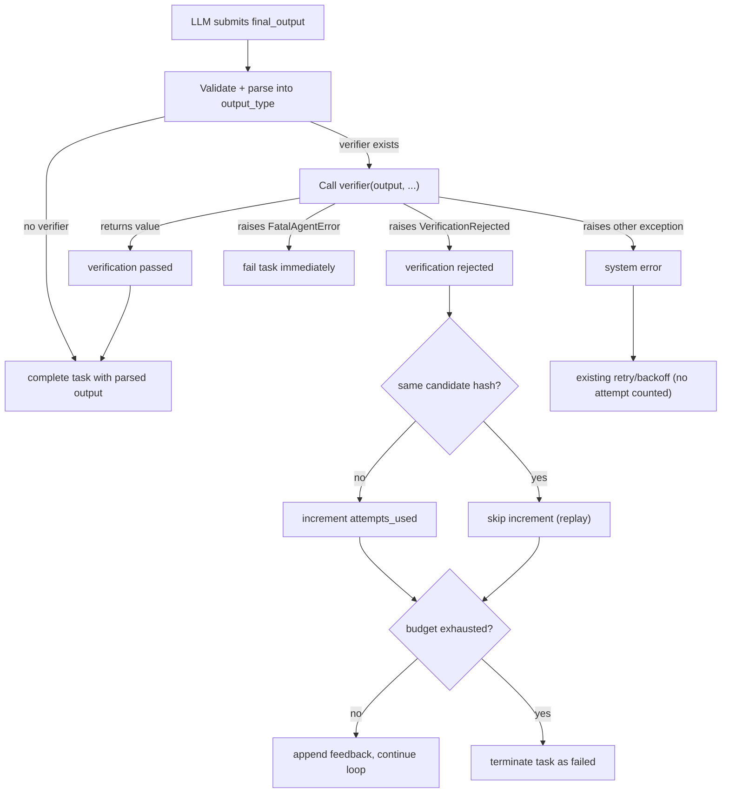

# Verifier Implementation Plan

> Status: Proposed (v1 simplified)
>
> This document defines the verifier architecture and DX for nfactorial.
> It is intentionally aligned with existing principles:
>
> - FastAPI-like learning curve
> - minimal surface area
> - deterministic distributed semantics
> - worker-only execution for user logic

## Problem Statement

We need a first-class verification mechanism that:

- gates completion when required
- supports bounded revision loops (e.g. 5 verification attempts)
- works under retries/restarts without miscounting attempts
- allows successful verification to return richer, user-defined final results
- does not force users to learn a heavyweight workflow framework

Current output handling (`output_type` + `final_output` tool) does not include a
standardized verification lifecycle.

## Design Goals

- Keep `final_output` tool name unchanged in v1. No rename.
- Verifier is a callable passed to `Agent(verifier=...)`, not a method on the output model.
- Verification failure is raised as an exception (`VerificationRejected`).
- Verification success may return a different type than the output model.
- Support configurable max verification attempts with deterministic accounting.
- Persist verification state in `AgentContext` (durably committed via the existing CONTINUE path).
- Zero queue/Lua changes required.

## Non-Goals

- Renaming `final_output` to `agent_output` in v1.
- Building a separate verifier queue/state machine.
- Running verifier logic in control-plane APIs.
- Exposing verifier internals (candidate hashes, counters) as mandatory user concepts.

---

## Public DX

### Agent Configuration

```python
from pydantic import BaseModel
from factorial import Agent, AgentContext, ExecutionContext
from factorial.exceptions import VerificationRejected


class AgentOutput(BaseModel):
    summary: str
    test_profile: str = "fast"


class VerificationMetadata(BaseModel):
    duration_ms: int
    tests_run: int
    failed: int


class FinalResult(BaseModel):
    summary: str
    verification: VerificationMetadata


async def verify_output(
    output: AgentOutput,
    agent_ctx: AgentContext,
) -> FinalResult:
    report = await run_verification(profile=output.test_profile)
    if not report.passed:
        raise VerificationRejected(
            message=report.summary,
            code="tests_failed",
            metadata={"failed_tests": report.failed_tests[:10]},
        )
    return FinalResult(
        summary=output.summary,
        verification=VerificationMetadata(
            duration_ms=report.duration_ms,
            tests_run=report.tests_run,
            failed=0,
        ),
    )


agent = Agent(
    instructions="...",
    tools=[...],
    output_type=AgentOutput,
    verifier=verify_output,
    verifier_max_attempts=5,
)
```

### Key Semantics

- Verifier returns a value: task completes with that value as the final output.
- Verifier raises `VerificationRejected`: attempt is counted, feedback is appended,
  model continues revising.
- Verifier raises `FatalAgentError`: task fails immediately regardless of remaining budget.
- Verifier raises any other exception: treated as system/runtime error. Does **not** count
  as a verification attempt. Handled by existing retry/backoff policies.

### Verifier Signature

The verifier is a callable (sync or async) passed to `Agent(verifier=...)`.

The first positional parameter is always the validated output model instance.
All other parameters are optional and DI-injected by name/type annotation,
using the same pattern as tool functions:

```python
# minimal
def verifier(output: AgentOutput) -> FinalResult: ...

# with agent context
async def verifier(output: AgentOutput, agent_ctx: AgentContext) -> FinalResult: ...

# full
async def verifier(
    output: AgentOutput,
    agent_ctx: AgentContext,
    execution_ctx: ExecutionContext,
) -> FinalResult: ...
```

---

## Exception Types

### VerificationRejected

```python
class VerificationRejected(Exception):
    def __init__(
        self,
        message: str,
        code: str | None = None,
        metadata: dict[str, Any] | None = None,
    ):
        self.message = message
        self.code = code
        self.metadata = metadata
        super().__init__(message)
```

Semantics:

- Always counts toward verification attempt budget.
- Always allows the model to revise (until budget exhausted).
- No `retryable` flag. If the verifier wants to fail immediately, raise `FatalAgentError`.

---

## Internal State Model

### VerificationState (persisted in AgentContext)

This state tracks control flow only, not product-level feedback copy.

```python
class VerificationState(BaseModel):
    attempts_used: int = 0
    last_candidate_hash: str | None = None
    last_outcome: str | None = None  # "passed" | "rejected" | "system_error"
```

Attach to `AgentContext`:

```python
class AgentContext(BaseModel):
    query: str
    messages: list[dict[str, Any]] = []
    turn: int = 0
    output: Any = None
    attempt: int = 0
    verification: VerificationState = Field(default_factory=VerificationState)
```

### Why AgentContext

- `AgentContext` is persisted in Redis as task payload and survives retries/restarts.
- `ExecutionContext` is per-worker runtime and must not be the source of truth for counters.

### Why No Lua or Queue Changes Are Needed

Verification rejection flows through the existing **CONTINUE** path, not RETRY/BACKOFF:

1. Verifier raises `VerificationRejected`.
2. Runtime increments `agent_ctx.verification.attempts_used`.
3. Runtime appends feedback to `agent_ctx.messages`.
4. `run_turn` returns `TurnCompletion(is_done=False)`.
5. Worker calls `complete(CONTINUE)`, which **already persists `agent_ctx`** in Lua.

System errors in verifier do not count as attempts, so there is nothing
verification-related to persist on the RETRY/BACKOFF paths.

---

## Candidate Hash and Retry-Safe Accounting

`last_candidate_hash` is a deterministic hash of the canonical serialized output
payload (sorted keys, compact JSON).

Purpose:

- Avoid double-counting attempts when the same rejected candidate is replayed
  due to worker crash/recovery in the narrow window between count and persist.
- Increment `attempts_used` only for newly submitted rejected candidates.

Rules:

1. Compute candidate hash before verification.
2. If rejection and hash differs from `last_candidate_hash` -> increment `attempts_used`.
3. If rejection and hash matches `last_candidate_hash` -> do not increment (idempotent replay).

---

## Runtime Lifecycle



### Verification Passed

- Validate and parse `final_output` arguments into `output_type` instance.
- Call `verifier(output, ...)`.
- Verifier returns a value -> `TurnCompletion(is_done=True, output=value)`.
- Worker calls `complete(COMPLETE)`.

### Verification Rejected

- Verifier raises `VerificationRejected`.
- Compute candidate hash; conditionally increment `attempts_used`.
- If budget remaining: append structured feedback to messages, return
  `TurnCompletion(is_done=False)`.
- If budget exhausted: fail the task.
- Worker calls `complete(CONTINUE)` which persists the updated `AgentContext`.

### Verification System Error

- Verifier raises an unexpected exception (not `VerificationRejected`, not `FatalAgentError`).
- Does **not** count as a verification attempt.
- Exception propagates to worker, handled by existing `classify_failure` ->
  RETRY/BACKOFF/FAIL.

### No Verifier Configured

- Existing behavior unchanged.
- `final_output` is extracted, stored as output, task completes.

---

## Message and Feedback Semantics

When verification rejects, model receives concise machine-readable feedback:

```xml
<verification_rejected code="tests_failed">
Summary: 3 regression tests failed.
Top failures:
- test_parser_generics
- test_codegen_switch
- test_linker_symbols
</verification_rejected>
```

This should be deterministic, compact, and low-noise.

---

## Output Validation

Today `_extract_output` parses `final_output` arguments with `json.loads()` but
does **not** call `output_type.model_validate(...)`. When a verifier is configured,
the runtime must validate the parsed dict into the `output_type` model before
calling the verifier. This ensures the verifier receives a typed instance.

If validation fails, treat it as an invalid LLM response (existing retry logic),
not as a verification attempt.

---

## API and Code Changes

### 1) Exception types

Add `VerificationRejected` to `src/factorial/exceptions.py`.

### 2) Context state

Add `VerificationState` to `src/factorial/context.py` and attach to `AgentContext`.

### 3) Agent config

Add to `BaseAgent.__init__`:

- `verifier: Callable[..., Any] | None = None`
- `verifier_max_attempts: int = 3`

Files:

- `src/factorial/agent.py`
- `src/factorial/__init__.py`

### 4) Agent runtime verification hook

In the completion handling path of `run_turn`:

- Detect `final_output` tool call (existing `_is_done` check).
- If `self.verifier` is set: validate output into `output_type`, call verifier
  with DI, apply pass/reject/system-error semantics, update `agent_ctx.verification`.
- If `self.verifier` is not set: existing behavior unchanged.

Files:

- `src/factorial/agent.py`

### 5) Events

Emit:

- `verification_passed`
- `verification_rejected`
- `verification_exhausted`

Files:

- `src/factorial/agent.py`

---

## Team Compatibility

Team runs can use the same verifier contract:

- Member agent submits `final_output`.
- Verifier gates completion at member task boundary.
- Team scheduler sees pass/fail as work-item success/revision/failure signals.

No special team-only verifier DSL required.

---

## Testing Plan

### Unit tests

- Verifier invocation with sync and async callables.
- DI injection of `agent_ctx` and `execution_ctx` based on signature.
- Candidate hash canonicalization.
- Attempt counting rules (new hash vs replay hash).
- Pass/reject/system-error branching.
- Output validation into `output_type` before verifier call.

### Integration tests

- Completes on verifier pass with transformed output.
- Rejects and continues until pass.
- Fails after `verifier_max_attempts` rejections.
- Does not double-count same rejected candidate on worker retry.
- Emits expected verification events.

### Regression tests

- Agent without verifier remains unchanged behavior.
- Agent with `output_type` but no verifier remains unchanged.
- Existing hooks/waits/deferred behavior unchanged.

Target files:

- `tests/unit/`
- `tests/integration/`
- `tests/e2e/`

---

## Summary

This plan introduces verifier gating with:

- Function-based verifier on `Agent(verifier=..., verifier_max_attempts=...)`.
- Output models stay as pure data (Pydantic models define shape, not behavior).
- Exception-first failure semantics (`VerificationRejected`, `FatalAgentError`).
- Bounded revision loops with deterministic attempt accounting via candidate hashes.
- State persisted in `AgentContext` via the existing CONTINUE path.
- Zero queue/Lua/Redis changes required.
- `final_output` tool name preserved in v1.

It keeps DX light while making autonomous runs safer and more predictable.
