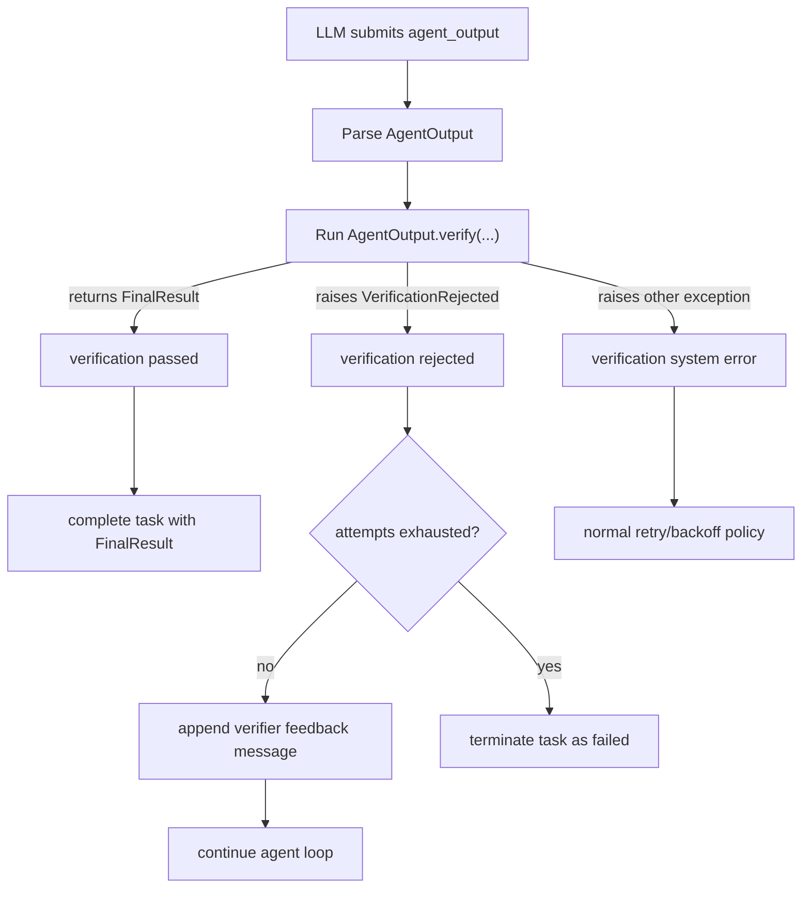

# Verifier Implementation Plan

> Status: Proposed
>
> This document defines the verifier architecture and DX for nfactorial.
> It is intentionally aligned with existing principles:
>
> - FastAPI-like learning curve
> - minimal surface area
> - deterministic distributed semantics
> - worker-only execution for user logic

## Problem Statement

We need a first-class verification mechanism that:

- gates completion when required
- supports bounded revision loops (for example, 5 verification attempts)
- works under retries/restarts without miscounting attempts
- allows successful verification to return richer, user-defined final results
- does not force users to learn a heavyweight workflow framework

Current output handling (`output_type` + `final_output` tool) does not include a
standardized verification lifecycle.

## Design Goals

- Rename model-submitted completion payload to `agent_output` (hard rename).
- Keep verification tied to output model convention, not separate framework DSL.
- Verification failure must be raised as an exception (not returned as success type).
- Verification success may return a different type than `AgentOutput`.
- Support configurable max verification attempts with deterministic accounting.
- Persist verification state in task payload (`AgentContext`) for correctness across retries.
- Keep queue/Lua state machine changes minimal unless strictly necessary.

## Non-Goals

- Building a separate verifier queue/state machine in v1.
- Running verifier logic in control-plane APIs.
- Exposing verifier internals (candidate hashes, counters) as mandatory user concepts.

---

## Public DX

## Naming

- Model submits: `agent_output` tool call (replaces `final_output`).
- Output model class in examples: `AgentOutput`.
- Verification return class in examples: `FinalResult`.

This naming is explicit and intuitive:

- `AgentOutput` = what the LLM proposes.
- `FinalResult` = what the system accepts and returns on completion.

## Output Model Contract

```python
from pydantic import BaseModel
from factorial import AgentContext, ExecutionContext
from factorial.verification import VerificationRejected


class AgentOutput(BaseModel):
    summary: str
    test_profile: str = "fast"

    async def verify(
        self,
        agent_ctx: AgentContext,
        execution_ctx: ExecutionContext,
    ) -> "FinalResult":
        report = await run_verification(profile=self.test_profile)
        if not report.passed:
            raise VerificationRejected(
                message=report.summary,
                retryable=True,
                code="tests_failed",
                metadata={"failed_tests": report.failed_tests[:10]},
            )
        return FinalResult(
            summary=self.summary,
            verification=VerificationMetadata(
                duration_ms=report.duration_ms,
                tests_run=report.tests_run,
                failed=0,
            ),
        )


class VerificationMetadata(BaseModel):
    duration_ms: int
    tests_run: int
    failed: int


class FinalResult(BaseModel):
    summary: str
    verification: VerificationMetadata
```

### Key semantics

- `verify(...)` success: returns `FinalResult` (or any serializable value).
- `verify(...)` failure: raises `VerificationRejected`.
- No success/failure union in return type.

## Max Attempt Policy

Declare max verification attempts primarily at agent definition:

```python
agent = Agent(
    ...,
    output_type=AgentOutput,
    verify_max_attempts=5,
)
```

Optional output model fallback:

```python
class AgentOutput(BaseModel):
    verify_max_attempts: ClassVar[int] = 5
```

Resolution precedence:

1. per-run override (future-compatible)
2. `Agent(..., verify_max_attempts=...)`
3. `AgentOutput.verify_max_attempts` class attribute
4. framework default (for example, 5)

---

## Internal State Model

## VerificationState (persisted in AgentContext)

This state tracks control flow only, not product-level feedback copy.

```python
class VerificationOutcome(str, Enum):
    PASSED = "passed"
    REJECTED = "rejected"
    SYSTEM_ERROR = "system_error"


class VerificationState(BaseModel):
    attempts_used: int = 0
    last_candidate_hash: str | None = None
    last_outcome: VerificationOutcome | None = None
    last_attempt_at: float | None = None
```

Attach to `AgentContext`:

```python
verification: VerificationState = Field(default_factory=VerificationState)
```

## Why AgentContext (not ExecutionContext)

- `AgentContext` is persisted in Redis as task payload and survives retries/restarts.
- `ExecutionContext` is per-worker runtime and should not be source of truth for counters.

---

## Candidate Hash and Retry-Safe Accounting

`last_candidate_hash` is a deterministic hash of canonical serialized `AgentOutput`
payload (sorted keys, stable JSON).

Purpose:

- avoid double-counting attempts when the same rejected candidate is replayed due to
  worker retries/restarts
- increment attempts only for newly submitted rejected candidates

Rules:

1. compute candidate hash before verification
2. if rejection and hash differs from `last_candidate_hash` -> increment attempts
3. if rejection and hash is same -> do not increment (idempotent replay)

---

## Runtime Lifecycle



## Behavior Details

### Verification passed

- `TurnCompletion.is_done = True`
- completion output is verifier return value (`FinalResult`)

### Verification rejected (`VerificationRejected`)

- reject completion attempt
- append structured verifier feedback into messages so model revises
- `TurnCompletion.is_done = False`
- continue loop unless attempt budget exhausted

### Verification system error (unexpected exception)

- treated as infrastructure/runtime failure
- does not count as verification attempt
- handled by existing retry/backoff policies

---

## Message and Feedback Semantics

When verification rejects, model receives concise machine-readable feedback, for example:

```xml
<verification_rejected code="tests_failed" retryable="true">
Summary: 3 regression tests failed.
Top failures:
- test_parser_generics
- test_codegen_switch
- test_linker_symbols
</verification_rejected>
```

This should be deterministic, compact, and low-noise.

---

## Queue and Lua Impact

## v1 approach: no new queue statuses required

Verifier gating occurs inside worker turn logic before task completion transition.

Implications:

- Reuse existing completion/backoff/fail transitions.
- No verifier-specific parked queue required in v1.
- No verifier-specific Lua transition needed for the synchronous verifier path.

Potential future expansion:

- long-running asynchronous verifiers can reuse hook/wait parking patterns if needed.

---

## API and Code Changes

## 1) Tools/output naming

- `create_final_output_tool(...)` -> `create_agent_output_tool(...)`
- model-facing tool name: `agent_output`
- remove `final_output` references from instructions/completion detection

Files:

- [src/factorial/tools.py](/Users/ricardo/Documents/code/nfactorial/src/factorial/tools.py)
- [src/factorial/agent.py](/Users/ricardo/Documents/code/nfactorial/src/factorial/agent.py)

## 2) Verification exception types

Add explicit verifier exception:

- `VerificationRejected(message, retryable=True, code=None, metadata=None)`

Files:

- [src/factorial/exceptions.py](/Users/ricardo/Documents/code/nfactorial/src/factorial/exceptions.py)

## 3) Context state

Add `VerificationState` and `VerificationOutcome` and attach to `AgentContext`.

Files:

- [src/factorial/context.py](/Users/ricardo/Documents/code/nfactorial/src/factorial/context.py)

## 4) Agent runtime verification hook

In completion handling path:

- detect `agent_output` candidate
- run verifier if output model defines `verify`
- apply pass/reject/system-error semantics
- update `AgentContext.verification`

Files:

- [src/factorial/agent.py](/Users/ricardo/Documents/code/nfactorial/src/factorial/agent.py)

## 5) Agent config

Add:

- `verify_max_attempts` on `Agent`/`BaseAgent`

Files:

- [src/factorial/agent.py](/Users/ricardo/Documents/code/nfactorial/src/factorial/agent.py)
- [src/factorial/__init__.py](/Users/ricardo/Documents/code/nfactorial/src/factorial/__init__.py)

## 6) Events

Emit:

- `verification_started`
- `verification_passed`
- `verification_rejected`
- `verification_attempt_counted`
- `verification_exhausted`

Files:

- [src/factorial/events.py](/Users/ricardo/Documents/code/nfactorial/src/factorial/events.py)
- [src/factorial/agent.py](/Users/ricardo/Documents/code/nfactorial/src/factorial/agent.py)

---

## Verification Signature Rules

Verifier method discovery:

- method name: `verify`
- owner: `output_type` model class

Accepted method shapes:

- instance method:
  - `async def verify(self, ...) -> Any`
- classmethod-style:
  - `@classmethod`
  - `async def verify(cls, output: Self, ...) -> Any`

DI-injected optional params:

- `agent_ctx: AgentContext`
- `execution_ctx: ExecutionContext`
- `attempt: int`
- `max_attempts: int`

On rejection, must raise `VerificationRejected`.

---

## Team Compatibility

Team runs can use the same verifier contract:

- member agent submits `agent_output`
- verifier gates completion at member task boundary
- team scheduler sees pass/fail as work-item success/revision/failure signals

No special team-only verifier DSL required.

---

## Testing Plan

## Unit tests

- verifier discovery and signature validation
- candidate hash canonicalization
- attempt counting rules (new hash vs replay hash)
- pass/reject/system-error branching

## Integration tests

- completes on verifier pass
- rejects and continues until pass
- fails after `verify_max_attempts` rejections
- does not double-count same rejected candidate on worker retry
- emits expected verification events

## Regression tests

- output model without verifier remains unchanged behavior
- existing hooks/waits/deferred behavior unchanged

Target files:

- [tests/unit/](/Users/ricardo/Documents/code/nfactorial/tests/unit)
- [tests/integration/](/Users/ricardo/Documents/code/nfactorial/tests/integration)
- [tests/e2e/](/Users/ricardo/Documents/code/nfactorial/tests/e2e)

---

## Rollout Plan

Phase A - Internal plumbing:

- add exceptions, state model, agent runtime hooks, events
- keep old `final_output` behavior untouched behind temporary compatibility switch

Phase B - Canonical rename:

- switch canonical tool to `agent_output`
- remove `final_output` references in prompts/instructions/docs

Phase C - Hard gate defaults:

- enable verification gating for agents with output verifier
- stabilize attempt budget policy and observability

Phase D - Docs/examples:

- publish minimal and advanced examples
- include migration notes from `FinalOutput` naming to `AgentOutput` naming

---

## Open Decisions

- Should max attempts be mandatory when verifier exists, or defaulted globally?
- Should verifier metadata be published only in events or also included in run metadata snapshot?
- Should non-retryable `VerificationRejected(retryable=False)` fail immediately regardless of attempts remaining?

---

## Summary

This plan introduces verifier gating with:

- intuitive naming (`agent_output` -> `FinalResult`)
- exception-first failure semantics
- bounded revision loops (`verify_max_attempts`)
- retry-safe attempt accounting via candidate hashes
- minimal disruption to existing queue/Lua architecture

It keeps DX light while making autonomous runs safer and more predictable.
