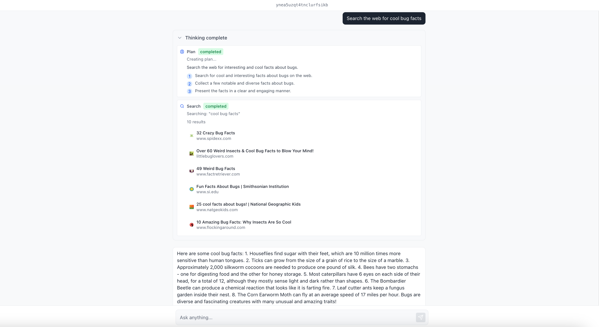

# Basic Search Agent

A simple agent with the ability to search the web and the ability to steer and cancel tasks mid-flight.



## 1. Create the agent

`agent.py`

```python
import os
from dotenv import load_dotenv
from factorial import Agent, AgentContext, gpt_41
from exa_py import Exa


load_dotenv()
exa = Exa(api_key=os.getenv("EXA_API_KEY"))


def search(query: str) -> tuple[str, list[dict[str, Any]]]:
    """Search the web for information"""
    result = exa.search_and_contents(
        query=query, num_results=10, text={"max_characters": 500}
    )
    data = [
        {"title": r.title, "url": r.url}
        for r in result.results
    ]

    return str(result), data

basic_agent = Agent(
    instructions="You are a helpful assistant. Always start by making a plan.",
    tools=[search],
    model=gpt_41,
)
```

The agent now has the ability to search the web.

## 2. Register the runner

`orchestrator.py`

```python
from factorial import Orchestrator, AgentWorkerConfig
from agent import basic_agent

orchestrator = Orchestrator(openai_api_key=os.getenv("OPENAI_API_KEY"))

orchestrator.register_runner(
    agent=basic_agent,
    agent_worker_config=AgentWorkerConfig(workers=50, turn_timeout=120),
)

if __name__ == "__main__":
    orchestrator.run()
```

`register_runner` spins up a pool of workers that pull tasks from Redis and drive the agent.

## 3. Expose an API & WebSocket

`server.py`

```python
from fastapi import FastAPI
from fastapi.middleware.cors import CORSMiddleware
from fastapi.exceptions import HTTPException
from pydantic import BaseModel
import json
from starlette.websockets import WebSocket, WebSocketDisconnect
from agent import basic_agent
from orchestrator import orchestrator

app = FastAPI()

@app.websocket("/ws/{user_id}")
async def websocket_updates(websocket: WebSocket, user_id: str):
    await websocket.accept()

    try:
        async for update in orchestrator.subscribe_to_updates(owner_id=user_id):
            await websocket.send_text(json.dumps(update))
    except WebSocketDisconnect:
        print(f"WebSocket disconnected for user_id={user_id}")


class EnqueueRequest(BaseModel):
    user_id: str
    message_history: list[dict[str, str]]
    query: str

@app.post("/api/enqueue")
async def enqueue(request: EnqueueRequest):
    task = basic_agent.create_task(
        owner_id=request.user_id,
        payload=AgentContext(
            messages=request.message_history,
            query=request.query,
        ),
    )

    await orchestrator.enqueue_task(agent=basic_agent, task=task)
    return {"task_id": task.id}


class SteerRequest(BaseModel):
    user_id: str
    task_id: str
    messages: list[dict[str, str]]

@app.post("/api/steer")
async def steer_task_endpoint(request: SteerRequest):
    try:
        await orchestrator.steer_task(
            task_id=request.task_id,
            messages=request.messages,
        )
        return {
            "success": True,
            "message": f"Steering messages sent for task {request.task_id}",
        }
    except Exception as e:
        return {"success": False, "error": str(e)}


class CancelRequest(BaseModel):
    user_id: str
    task_id: str

@app.post("/api/cancel")
async def cancel_task_endpoint(request: CancelRequest):
    try:
        await orchestrator.cancel_task(task_id=request.task_id)
        return {
            "success": True,
            "message": f"Task {request.task_id} marked for cancellation",
        }
    except Exception as e:
        return {"success": False, "error": str(e)}

```

## 4. Queue your first task

```bash
curl -X POST http://localhost:8000/api/enqueue \
  -H "Content-Type: application/json" \
  -d '{
        "user_id":"demo",
        "message_history":[],
        "query":"What is the capital of France?"
      }'
```

The response contains the `task_id`. Open the WebSocket at `ws://localhost:8000/ws/demo` to watch progress in real-time.

## 5. Steering & cancellation

```bash
# append a follow-up instruction
curl -X POST http://localhost:8000/api/steer \
  -d '{"user_id":"demo","task_id":"<id>","messages":[{"role":"user","content":"make it short"}]}'

# stop the task
curl -X POST http://localhost:8000/api/cancel \
  -d '{"user_id":"demo","task_id":"<id>"}'
```

`steer` publishes `run_steering_applied` / `run_steering_failed` events.  
`cancel` publishes `run_cancelled`.

## 6. Run everything

```bash
# run orchestrator
python orchestrator.py
# run api
python server.py
```
