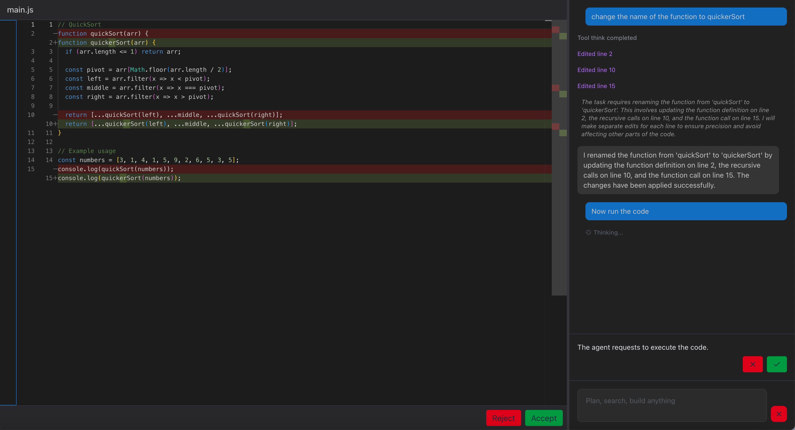

# Code Agent

An IDE-based agent that can write and edit code and *request the user* to execute code. 




## Recreating Cursor-style 'Waiting for approval...' tools


<div style={{textAlign: 'center'}}>

</div>
<br/>

When we want the agent to do something that requires user approval we want to:
1. Prompt the user of the action we want to take
2. Put the agent in a pending idle state
3. Wait for user rejection / approval
4. Continue

## 1. Create the agent

We want to give the agent 3 tools, the ability to think/make a plan, the ability to write code, and the ability to request the user to execute code.

Note that `edit_code` is the only tool that does any real work in this example, think is simply a way to let the agent log its thoughts and
`request_code_execution` will simply put the agent in the idle pending state until the code has been executed (in the client) or rejected and 
the result submitted with the _approve_or_reject_ endpoint.

`agent.py`

```python
import os
from typing import Any
from dotenv import load_dotenv
from factorial import (
    BaseAgent,
    AgentContext,
    ExecutionContext,
    gpt_41_mini,
    deferred_result,
)


load_dotenv()


class IdeAgentContext(AgentContext):
    code: str


def think(thoughts: str) -> str:
    """Think deeply about the task and plan your next steps before executing"""
    return thoughts


def edit_code(
    find: str,
    find_start_line: int,
    find_end_line: int,
    replace: str,
    agent_ctx: IdeAgentContext,
) -> tuple[str, dict[str, Any]]:
    """
    Edit code in a file

    Arguments:
    find: The text to find and replace
    find_start_line: The start line number where the 'find' text is located
    find_end_line: The end line number where the 'find' text is located
    replace: The text to replace the 'find' text with
    """
    lines = agent_ctx.code.split("\n")
    start_idx = find_start_line - 1
    end_idx = find_end_line - 1
    if start_idx < 0 or end_idx >= len(lines) or start_idx > end_idx:
        return "Error: Invalid line numbers", {
            "error": "Line numbers out of range or invalid",
            "total_lines": len(lines),
        }

    existing_text = "\n".join(lines[start_idx : end_idx + 1])

    # Check if the find text matches what's at those line numbers
    if find not in existing_text:
        return (
            f"Error: Text '{find}' not found at lines {find_start_line}-{find_end_line}",
            {
                "error": "Find text not found at specified lines",
                "existing_text": existing_text,
            },
        )

    new_text = existing_text.replace(find, replace)
    new_lines = lines[:start_idx] + new_text.split("\n") + lines[end_idx + 1 :]

    # Update the agent context with the modified code
    agent_ctx.code = "\n".join(new_lines)

    return (
        f"Code successfully edited: replaced '{find}' with '{replace}' at lines {find_start_line}-{find_end_line}",
        {
            "find": find,
            "find_start_line": find_start_line,
            "find_end_line": find_end_line,
            "replace": replace,
            "new_code": agent_ctx.code,
        },
    )


@deferred_result(timeout=300.0)  # 5-minute timeout waiting for user decision
def request_code_execution(
    response_on_reject: str, agent_ctx: AgentContext, execution_ctx: ExecutionContext
) -> None:
    """
    Request the code to be run. The use must approve this request before the code is run.

    Parameters
    ----------
    response_on_reject : str
        A message the agent should send if the user rejects the execution request.
    """
    pass


instructions = """
You are an IDE assistant that helps with coding tasks. You can write, read, analyze, and execute code. 
For anything non-trivial, always start by making a plan for the coding task.

The code will be displayed with line numbers in the following format. The code you write should not
contain line numbers.

[1]def hello_world():
[2]    print("Hello, world!")

In your final response, just clearly and consisely explain what you did without writing any code. 
The code changes will be shown to the user in a diff editor.
"""


class IDEAgent(BaseAgent[IdeAgentContext]):
    def __init__(self):
        super().__init__(
            context_class=IdeAgentContext,
            instructions=instructions,
            tools=[think, edit_code, request_code_execution],
            model=gpt_41_mini,
        )

    def prepare_messages(self, agent_ctx: IdeAgentContext) -> list[dict[str, Any]]:
        if agent_ctx.turn == 0:
            messages = [{"role": "system", "content": self.instructions}]
            if agent_ctx.messages:
                messages.extend(
                    [message for message in agent_ctx.messages if message["content"]]
                )

            code = "\n".join(
                [f"[{i + 1}]{line}" for i, line in enumerate(agent_ctx.code.split("\n"))]
            )
            messages.append(
                {
                    "role": "user",
                    "content": f"Code file with line numbers:\n{code}\n---\nQuery: {agent_ctx.query}",
                }
            )
        else:
            messages = agent_ctx.messages

        return messages


ide_agent = IDEAgent()
```

The agent now has the ability to think, write code, and request the user to execute the code.

## 2. Register the runner

`orchestrator.py`

```python
from factorial import Orchestrator, AgentWorkerConfig
from agent import ide_agent

orchestrator = Orchestrator(openai_api_key=os.getenv("OPENAI_API_KEY"))

orchestrator.register_runner(
    agent=ide_agent,
    agent_worker_config=AgentWorkerConfig(workers=50, turn_timeout=120),
)

if __name__ == "__main__":
    orchestrator.run()
```

`register_runner` spins up a pool of workers that pull tasks from Redis and drive the agent.

## 3. Expose an API & WebSocket

`server.py`

```python
from fastapi import FastAPI
from fastapi.middleware.cors import CORSMiddleware
from fastapi.exceptions import HTTPException
from pydantic import BaseModel
import json
from starlette.websockets import WebSocket, WebSocketDisconnect
from agent import basic_agent
from orchestrator import orchestrator

app = FastAPI()

app.add_middleware(
    CORSMiddleware,
    allow_origins=["*"],
    allow_credentials=True,
    allow_methods=["*"],
    allow_headers=["*"],
)


@app.websocket("/ws/{user_id}")
async def websocket_updates(websocket: WebSocket, user_id: str):
    await websocket.accept()

    try:
        async for update in orchestrator.subscribe_to_updates(owner_id=user_id):
            await websocket.send_text(json.dumps(update))
    except WebSocketDisconnect:
        print(f"WebSocket disconnected for user_id={user_id}")


class EnqueueRequest(BaseModel):
    user_id: str
    message_history: list[dict[str, str]]
    query: str
    code: str

@app.post("/api/enqueue")
async def enqueue(request: EnqueueRequest):
    task = ide_agent.create_task(
        owner_id=request.user_id,
        payload=IdeAgentContext(
            messages=request.message_history,
            query=request.query,
            turn=0,
            code=request.code,
        ),
    )

    await orchestrator.enqueue_task(agent=ide_agent, task=task)
    return {"task_id": task.id}


class CancelRequest(BaseModel):
    user_id: str
    task_id: str

@app.post("/api/cancel")
async def cancel_task_endpoint(request: CancelRequest):
    try:
        await orchestrator.cancel_task(task_id=request.task_id)
        return {
            "success": True,
            "message": f"Task {request.task_id} marked for cancellation",
        }
    except Exception as e:
        return {"success": False, "error": str(e)}


class ApproveOrRejectRequest(BaseModel):
    user_id: str
    task_id: str
    tool_call_id: str
    result: str


@app.post("/api/approve_or_reject")
async def approve_or_reject_endpoint(request: CompleteToolRequest):
    """Complete a deferred tool call with the provided result."""
    try:
        success = await orchestrator.complete_deferred_tool(
            task_id=request.task_id,
            tool_call_id=request.tool_call_id,
            result=request.result,
        )
        if success:
            return {"success": True}
        raise HTTPException(status_code=500, detail="Unable to complete deferred tool.")
    except Exception as e:
        print(f"Failed to complete deferred tool call {request.tool_call_id}: {e}")
        raise HTTPException(status_code=500, detail=str(e))

```