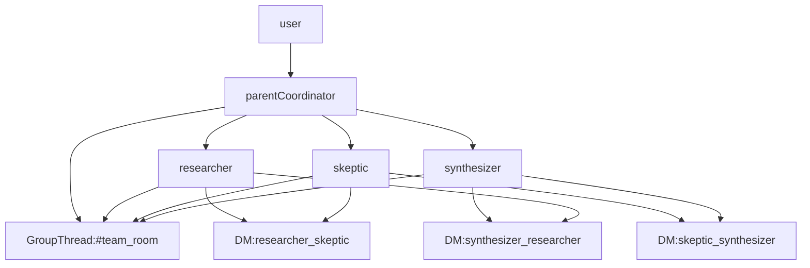
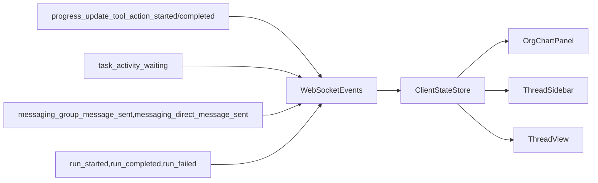

# Group Chat Agent

A minimal, practical multi-agent demo showing:

- one parent coordinator spawning subagents
- group chat messages in a shared channel
- direct messages between subagent pairs
- optional parent-to-subagent DMs with subagent replies
- `wait.activity` pause and wake behavior
- a UI that makes hierarchy and threads obvious

## What This Demo Proves

- Parent and subagents run as separate tasks.
- Agents can send group messages with `messaging.groups.send(...)`.
- Agents can send direct messages with `messaging.send(...)`.
- Tasks can park on `wait.activity(...)` and wake from peer/system activity.

## Architecture



## Runtime Event Flow



## Key Files

- Agent logic: `examples/group_chat_agent/agent.py`
- API and websocket server: `examples/group_chat_agent/server.py`
- UI root: `examples/group_chat_agent/ui/src/App.tsx`
- Event parsing/state updates: `examples/group_chat_agent/ui/src/hooks/useWebSocket.ts`
- UI components:
  - `examples/group_chat_agent/ui/src/components/OrgChart.tsx`
  - `examples/group_chat_agent/ui/src/components/ThreadSidebar.tsx`
  - `examples/group_chat_agent/ui/src/components/ThreadView.tsx`

## Run with Docker

```bash
cd examples/group_chat_agent
export OPENAI_API_KEY=...
docker-compose up
```

Open:

- UI: [http://localhost:5173](http://localhost:5173)
- Dashboard: [http://localhost:8081](http://localhost:8081)

## What to Observe in the UI

1. Parent node appears first, then child nodes after `spawn_team`.
2. `#team_room` shows group messages from multiple agents.
3. DM threads appear between two-agent pairs and can include parent follow-ups.
4. Clicking any hierarchy node opens that agent's individual trace timeline.
5. System thread logs wait enter/wake transitions.
6. Parent finishes with a synthesis output after subagent communication.
