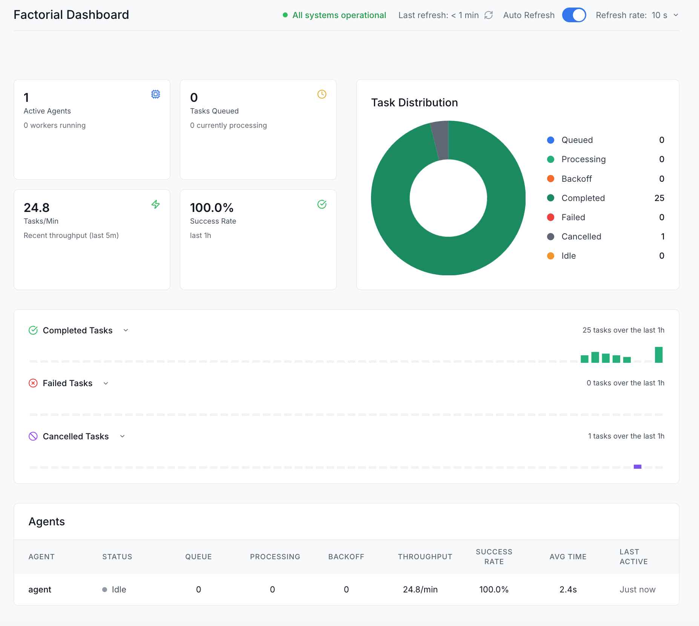

# Quickstart

Get started with Factorial in minutes.

## Installation

```bash
pip install nfactorial
```

## Set up Redis

Factorial uses Redis for distributed task management. Run Redis locally:

```bash
# Using Docker
docker run -d -p 6379:6379 redis:latest

# Or install locally (macOS)
brew install redis
redis-server
```

## Set your LLM API Keys

Set your OpenAI/xAI/Anthropic API key(s):

```bash
export OPENAI_API_KEY=...
export XAI_API_KEY=...
export ANTHROPIC_API_KEY=...
```

## Create your first agent

```python
from factorial import Agent, Orchestrator, AgentWorkerConfig, gpt_41


def get_weather(location: str) -> str:
    return f"The weather in {location} is sunny and 72°F"


agent = Agent(
    instructions="You help users get weather information.",
    model=gpt_41,
    tools=[get_weather],
)

# Create orchestrator
orchestrator = Orchestrator(
    redis_host="localhost",
    redis_port=6379,
    redis_db=0,
    redis_max_connections=50,
)
orchestrator.register_runner(
    agent=agent, agent_worker_config=AgentWorkerConfig(workers=1)
)

# Run the system
if __name__ == "__main__":
    orchestrator.run()

```

## Submit a task

In another terminal or script:

```python
import asyncio
from factorial import AgentContext

async def main():
    # Create and enqueue task
    task = await orchestrator.enqueue_task(
        agent=agent,
        owner_id="user123",
        payload=AgentContext(query="What's the weather in San Francisco?"),
    )
    print("Enqueued task:", task.id)
    
    # Check status
    status = await orchestrator.get_task_status(task.id)
    print(f"Task status: {status}")

asyncio.run(main())
```

## View the dashboard

Open http://localhost:8080/observability to see the real-time dashboard with task queues, metrics, and agent performance.


