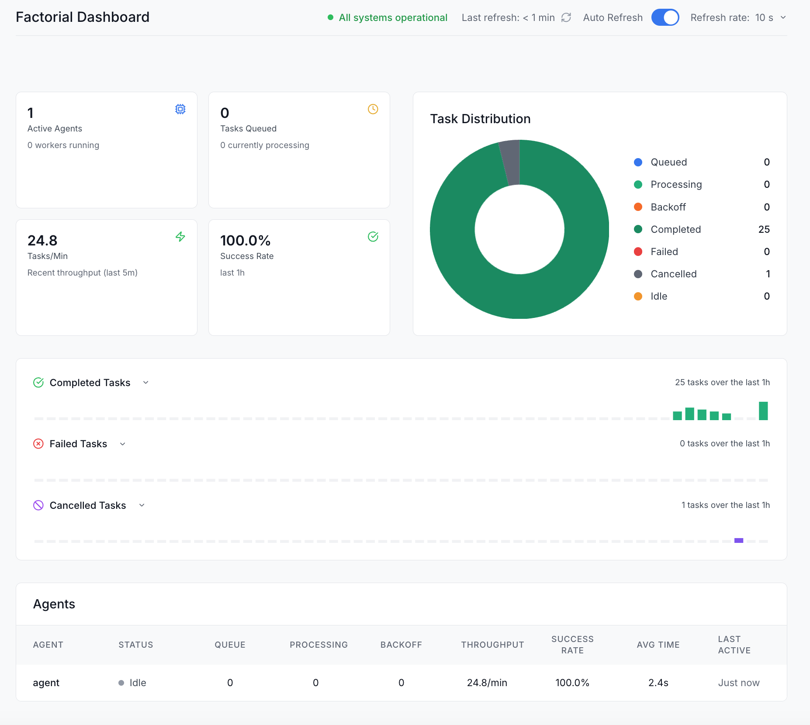

# Quickstart

Factorial supports two execution modes:

- **Direct runs** with `await agent.run(...)` or `agent.stream(...)`
- **Queued runs** with `Orchestrator`, Redis, task handles, waits, hooks, and distributed workers

If you only need a local LLM + tools loop, start with direct runs. If you need waits, subagents, messaging, approvals, retries, or human control-plane actions, use the orchestrator.

## Installation

```bash
pip install nfactorial
```

## Direct Run

Direct runs do not require Redis.

```python
import asyncio

from factorial import Agent, gpt_41


def get_weather(location: str) -> str:
    return f"The weather in {location} is sunny and 72°F"


agent = Agent(
    instructions="You help users get weather information.",
    model=gpt_41,
    tools=[get_weather],
)


async def main() -> None:
    result = await agent.run("What's the weather in San Francisco?")
    print(result.output)


asyncio.run(main())
```

You can also stream typed lifecycle events from a direct run:

```python
import asyncio

from factorial import Agent, FinishEvent, gpt_41


agent = Agent(
    instructions="Be concise.",
    model=gpt_41,
)


async def main() -> None:
    async for event in agent.stream("Summarize nfactorial in one sentence."):
        print(type(event).__name__)
        if isinstance(event, FinishEvent):
            print(event.output)


asyncio.run(main())
```

Use direct runs for synchronous workflows. If your agent can pause on hooks or waits, spawn subagents, or rely on runtime messaging, inbox, or signal APIs, move to the orchestrator.

## Queued / Distributed Run

### 1. Start Redis

Factorial uses Redis as the source of truth for queued execution:

```bash
# Using Docker
docker run -d -p 6379:6379 redis:latest

# Or install locally (macOS)
brew install redis
redis-server
```

### 2. Set your model provider keys

```bash
export OPENAI_API_KEY=...
export XAI_API_KEY=...
export ANTHROPIC_API_KEY=...
```

### 3. Register an agent with the orchestrator

```python
from factorial import Agent, AgentWorkerConfig, Orchestrator, gpt_41


def get_weather(location: str) -> str:
    return f"The weather in {location} is sunny and 72°F"


agent = Agent(
    name="weather_agent",
    instructions="You help users get weather information.",
    model=gpt_41,
    tools=[get_weather],
)

orchestrator = Orchestrator(
    redis_host="localhost",
    redis_port=6379,
    redis_db=0,
    redis_max_connections=50,
)

orchestrator.register(
    agent=agent,
    agent_worker_config=AgentWorkerConfig(workers=1),
)


if __name__ == "__main__":
    orchestrator.run()
```

### 4. Enqueue a task and wait for the result

```python
import asyncio


async def main() -> None:
    task = await orchestrator.enqueue(
        agent,
        input="What's the weather in San Francisco?",
        owner_id="user123",
    )

    print(task.id)

    snapshot = await task.snapshot()
    print(snapshot.status)

    result = await task.wait()
    print(result.output)


asyncio.run(main())
```

`enqueue(...)` returns a `TaskHandle`. Use it to:

- inspect snapshots with `task.snapshot()`
- wait for completion with `task.wait()`
- stream typed updates with `task.updates()`
- steer, cancel, wake, or branch runs

### 5. Subscribe to queued updates

Use `owner_id` to subscribe to all runs for a user or session:

```python
async for update in orchestrator.subscribe_to_updates(owner_id="user123"):
    print(update["event_type"], update["task_id"])
```

## View the dashboard

Open `http://localhost:8080/observability` to inspect queues, workers, task states, and metrics.


