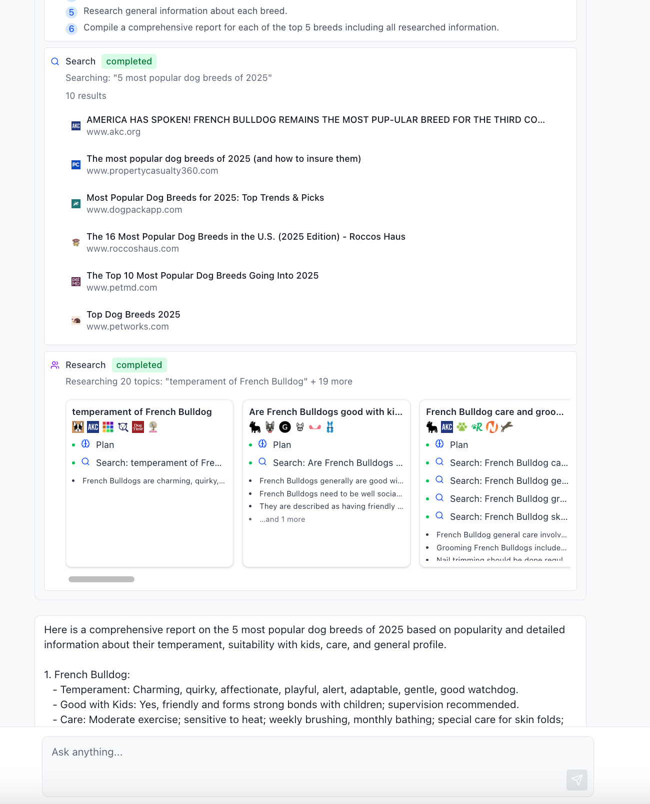

# Research Agent Example

AI agent that can search the web, make plans, spin up independent research subagents, and reflect on tasks.
This example routes model calls through the Vercel AI Gateway.



## Quick Start with Docker

1. Set up environment (one of these):

```bash
# Option A: export in your shell
export AI_GATEWAY_API_KEY=...
export EXA_API_KEY=...

# Option B: create a `.env` file next to docker-compose.yml with:
# AI_GATEWAY_API_KEY=...
# EXA_API_KEY=...

# Optional UI overrides (defaults are fine for local docker-compose):
# VITE_API_BASE_URL=http://localhost:8000/api
# VITE_WS_BASE_URL=ws://localhost:8000/ws
```

1. Run everything:

```bash
docker-compose up
```

1. Open:

- UI: <http://localhost:5173>
- Dashboard: <http://localhost:8081>

## Manual Setup

### Prerequisites

- Python 3.9+, Node.js 18+, Redis

### Install & Run

```bash
# 1. Set up .env file (manually create it in this directory)
# AI_GATEWAY_API_KEY=...
# EXA_API_KEY=...

# 2. Install Python Dependencies
pip install -r requirements.txt
pip install -e .

# 3. Install UI Dependencies
cd ui
npm install

# 4. Start Redis
redis-server

# 5. Run components (separate terminals):
python agent.py    # Agent workers
python server.py   # API server
cd ui && npm run dev  # UI
```

### URLs

- UI: <http://localhost:5173>
- Dashboard: <http://localhost:8081>
